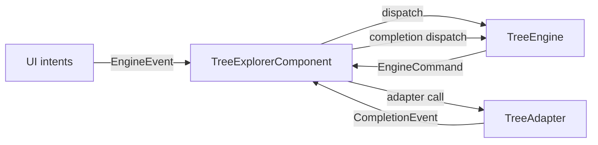
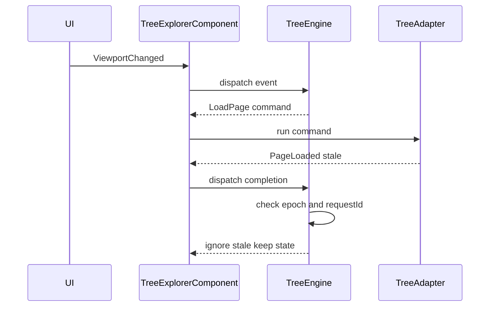
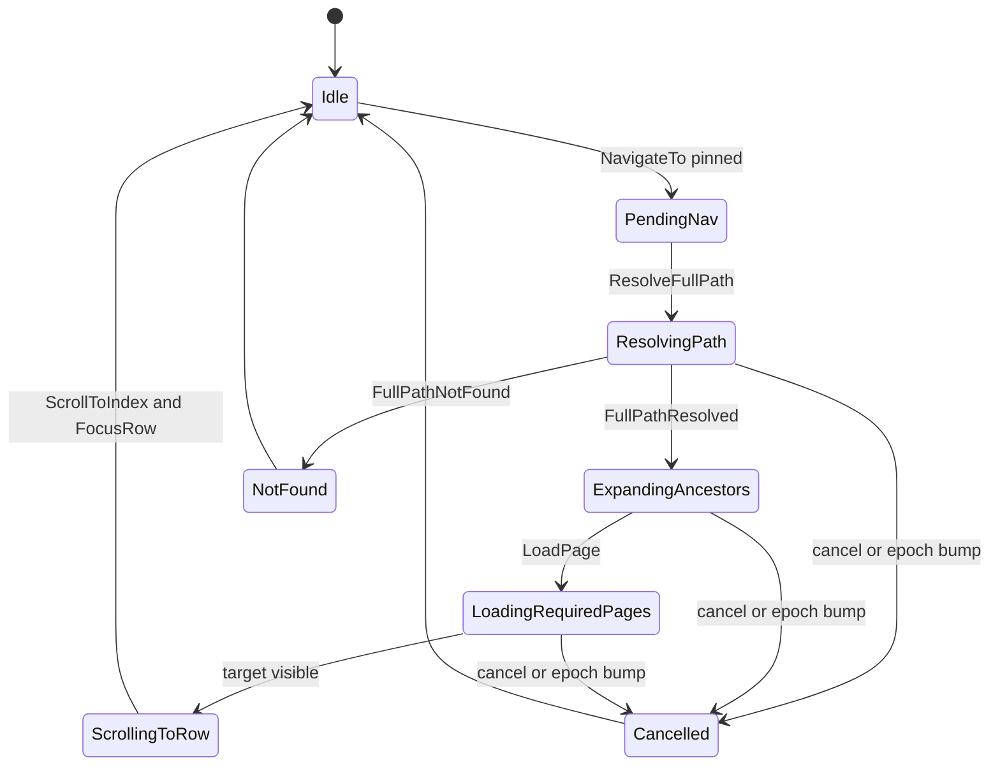

# Architecture Overview

## 1) System Boundaries

### `@tree-core`
- Owns `TreeEngine` and all state transitions.
- Owns normalized indexing, projection/flattening strategy, expansion, selection, paging/loading state, filtering state, visibility, and navigation.
- Exposes deterministic events, commands, selectors, and snapshot types.
- Contains no framework-specific imports.

### `@tree-explorer` (Angular host)
- Owns `TreeExplorerComponent` as the single Angular entry point.
- Owns DOM intent translation, command execution, viewport reporting, keyboard wiring, and context menu DOM rendering.
- Must not contain domain semantics or direct data-source logic.

### `TreeAdapter` (domain boundary)
- Owns ID mapping, labels/icons, root/child retrieval, filtering semantics, and optional path resolution.
- Owns optional path resolution; if pinned navigation is enabled, adapter MUST provide full-path resolution for a target id (root -> ... -> target) so the host/engine can execute a bounded number of requests (avoid N+1).
- Is the only place allowed to encode domain/API behavior.

## 2) Fixed Runtime Flow

`UI intents -> TreeExplorerComponent -> TreeEngine -> derived outputs -> rendering`

- Intents are translated to `EngineEvent`.
- `TreeEngine.dispatch(event)` is pure and deterministic.
- Engine emits `EngineCommand[]` describing side effects.
- Host executes commands and dispatches completion events.
- Snapshot selectors (`totalCount`, `rowAt(index)`, `rowKeyAt(index)`) drive render output.

## 3) Page-Aware Model (Canonical)

- Paging key is parent-aware: `{ parentId | null, pageIndex, pageSize }`.
- Root paging and child paging share the same command semantics.
- Viewport range drives required page calculation.
- Dedupe uses canonical in-flight/loaded tracking by parent-aware page key.
- Async completion merge is guarded by `epoch` + `requestId`; stale results are ignored.

### Stale-discard sequence
1. Host dispatches `EngineEvent.ViewportChanged`, `EngineEvent.SetFilter`, or `EngineEvent.ToggleExpand`.
2. Engine increments epoch on structural/filter invalidation when needed and emits `EngineCommand.LoadPage`.
3. Host executes `EngineCommand[]` via adapter calls and dispatches completion events.
4. Completion arrives with stale epoch or unknown requestId.
5. Engine ignores stale completion; state remains unchanged.

## 3.x) Canonical Events & Commands (Naming)

### EngineEvent
- `ViewportChanged({ startIndex, endIndex, overscan })`
- `ToggleExpand({ id })`
- `SetFilter({ query })`
- `SelectToggle({ id, mode })`
- `NavigateTo({ id, reason: 'pinned' | 'user' })`

### EngineCommand
- `LoadPage({ parentId|null, pageIndex, pageSize, epoch, requestId })`
- `ResolveFullPath({ targetId, epoch, requestId })` (required when pinned navigation is enabled)
- `ScrollToIndex({ index })`
- `FocusRow({ rowKey })`

### Completion Events
- `PageLoaded({ key, items, epoch, requestId })`
- `FullPathResolved({ targetId, ancestorIds, epoch, requestId })`
- `FullPathNotFound({ targetId, epoch, requestId })`

Diagrams and tests MUST use these names for clarity.

## 4) Core Invariants

- `TreeExplorerComponent` is the only Angular entry point.
- Adapter is the only domain boundary.
- Engine is the only state transition authority.
- Projection is index-addressable via `totalCount` and `rowAt(index)`.
- Row identity must be stable within an epoch (`rowKeyAt(index)` must not flap).
- Selection must be representable without requiring nodes to be loaded (e.g., explicit ids and/or all-minus-exceptions).
- Navigation must support pending navigation state when target is not loaded yet.
- Pinned navigation requires full-path resolution: adapter MUST return the full ancestor chain for a pinned target (root -> ... -> target) so the engine can schedule a bounded sequence of page loads and avoid N+1.
- Virtualization assumes fixed row height (`itemSize`).
- Engine must not retain large domain payloads per node; cap retained metadata and never materialize visible row arrays.
- Async orchestration is command-based with stale protection.
- Context menu DOM ownership remains in `TreeExplorerComponent`.
- Config toggles are input-driven: virtualization, pageAware, selection, contextMenu, pinned.

### Pinned Navigation Contract

Pinned navigation targets may reference nodes that are not currently loaded. The engine must resolve path + loading deterministically, then scroll/focus only when the target is visible.

- Required adapter capability when pinned navigation is enabled:
  - `resolveFullPath(targetId) -> { ancestorIds: string[] }`
  - Returned chain must represent `root -> ... -> target`.
- This enables a bounded number of sequential requests and avoids N+1 probing loops.

## 5) Forbidden Patterns

- Any adapter or API calls inside presentational row components.
- Any direct node mutation that bypasses engine events/reducer.
- Any parallel materialized visible-row cache arrays.
- Any alternate state owner that competes with `TreeEngine`.
- Any projection logic that relies on unstable row identity.

## 6) Non-goals

- Variable-height virtualization in v1.
- Multi-host compatibility wrappers that duplicate Angular entry points.
- Domain-specific persistence behavior in UI components.

## 7) Compliance Checklist

- [ ] Flow is exactly `UI intents -> TreeExplorerComponent -> TreeEngine -> derived outputs -> rendering`.
- [ ] Adapter owns IDs, labels/icons, roots/children, filtering semantics, optional path resolution.
- [ ] If pinned navigation is enabled, adapter provides full-path resolution (`root -> ... -> target`) for target ids.
- [ ] `TreeEngine` owns orchestration and all transitions.
- [ ] `totalCount` + `rowAt(index)` power virtual rendering.
- [ ] Row identity is stable within an epoch (`rowKeyAt(index)` does not flap).
- [ ] Parent-aware paging model is used consistently (`parentId|null + pageIndex + pageSize`).
- [ ] Selection state is representable without requiring all selected nodes to be loaded.
- [ ] Pending navigation state exists for navigation targets that are not yet loaded.
- [ ] Canonical event/command naming is used in diagrams/tests.
- [ ] Stale-discard: epoch + requestId ignore rules are enforced (state unchanged on stale).
- [ ] Paging dedupe by parent-aware key is enforced.
- [ ] Selection works without loading nodes; select-all uses all-minus-exceptions if present.
- [ ] Pinned nav requires ResolveFullPath (single call) returning full ancestor chain; bounded loads; no N+1.
- [ ] No direct node mutation outside engine transitions.
- [ ] No materialized visible-row cache arrays.
- [ ] Context menu DOM is owned by `TreeExplorerComponent`.
- [ ] Stale async responses are ignored via `epoch` + `requestId` checks.

## 8) Testability & Acceptance Properties

### Test Harness Requirements
- Deterministic fake adapter with controllable latency and out-of-order responses.
- Ability to simulate adapter errors and not-found results for full-path resolution.
- Host runner that executes `EngineCommand[]` and dispatches completion events back to engine.
- Assertion helper for `state unchanged` checks on ignored/stale completions.

### Acceptance Properties

- P1: If a completion event arrives with `epoch < currentEpoch`, state MUST remain unchanged.
  - How to test: Dispatch stale `CompletionEvents.PageLoaded` after an epoch bump; assert deep-equal state snapshot.
- P2: If `requestId` is unknown for the current epoch, state MUST remain unchanged.
  - How to test: Dispatch completion with unknown `requestId`; assert no state or command delta.
- P3: For any viewport range, `EngineCommand.LoadPage` commands MUST be deduped by parent-aware page key (in-flight/loaded tracked).
  - How to test: Fuzz viewport ranges; assert unique emitted keys per epoch.
- P4: Moving the viewport emits `LoadPage` only for missing pages.
  - How to test: Pre-mark loaded/in-flight keys; verify command set equals expected missing set.
- P5: Within an epoch, `rowKeyAt(index)` MUST be stable for the same index (no flapping).
  - How to test: Query repeated indices across no-op intents; assert key equality.
- P6: Selection MUST be representable without requiring nodes to be loaded.
  - How to test: Select unloaded ids; assert selection model stores intent without forced loads.
- P7: If select-all is supported, membership checks MUST be O(1) via all-minus-exceptions (no enumerating 500k ids).
  - How to test: Benchmark membership operations and verify no full-id materialization.
- P8: If pinned navigation enabled, `EngineEvent.NavigateTo(reason:'pinned')` MUST issue exactly one `EngineCommand.ResolveFullPath`.
  - How to test: Dispatch pinned navigation intent; assert one resolve command only.
- P9: After `CompletionEvents.FullPathResolved`, the engine MUST schedule a bounded sequence of loads/expands (no N+1 loops).
  - How to test: Provide known ancestor chain depth; assert load/expand command count is bounded by path depth and page requirements.
- P10: Navigation remains pending until the target becomes visible; only then emit `ScrollToIndex`/`FocusRow`.
  - How to test: Replay partial completions; assert no scroll/focus command before visibility precondition.

## 9) Diagrams

### System Boundaries Flow

### Stale-Discard Sequence

### Pinned Navigation State Machine

