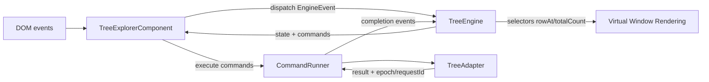
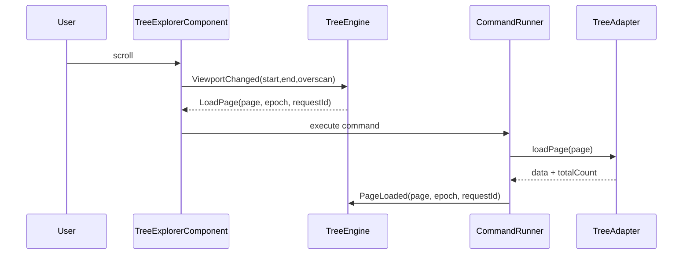
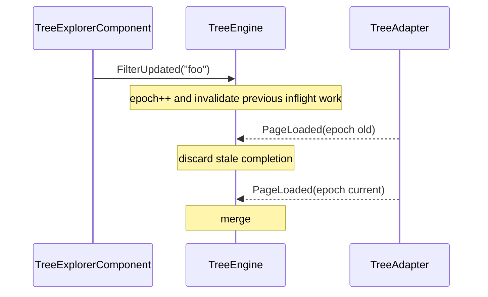

# Architecture Overview

Reference baseline: `docs/diagrams_angular.md`.
Decision log references: `docs/diagrams_angular.md` section "Decision Log Updates (Angular-Specific)".

## Package Boundaries
- `@tree-core`
- Owns `TreeEngine`, reducer/state transitions, projection/indexing, paging/loading orchestration state, filtering state, selection, navigation, selectors, and canonical types.
- Has no framework imports.
- `@tree-explorer` (Angular wrapper)
- Owns `TreeExplorerComponent`, DOM event wiring, command execution pipeline, viewport handling, context menu rendering, and Angular outputs.
- Does not own domain semantics.
- Adapter boundary (`TreeAdapter`)
- Owns IDs, labels/icons, roots/children retrieval, filtering semantics, and optional path resolution.
- Is the only domain-specific boundary.

## Event and Command Model
- UI produces intent events (`ViewportChanged`, `ToggleExpand`, `SelectIntent`, `NavKey`, `FilterUpdated`).
- `TreeEngine.dispatch(event)` is pure and deterministic.
- Engine emits commands (`LoadPage`, `LoadChildren`, `ScrollTo`, output emissions).
- Host command runner executes adapter/DOM side effects.
- Completion events return into the engine (`PageLoaded`, `ChildrenLoaded`, `LoadFailed`).
- Async correctness is guarded with `epoch` + `requestId`.

## Invariants
- Flow is fixed: UI intents -> `TreeExplorerComponent` -> `TreeEngine` -> derived outputs -> rendering.
- No `visibleRows[]` cache in any layer.
- No direct node mutation outside reducer transitions.
- Adapter logic never leaks into components.
- Context menu ownership stays in `TreeExplorerComponent`.
- Config toggles are input-driven (`virtualization`, `pageAware`, `selection`, `contextMenu`, `pinned`).

## What Lives Where
- `@tree-core`
- All state transitions.
- Normalized ERM-style model (`nodeId` keys + relations).
- Projection API (`totalCount`, `rowAt`, `rowKeyAt`).
- `@tree-explorer`
- Input adapters/config.
- Intent translation from DOM to engine events.
- Command runner and render scheduling.
- Virtual window rendering and A11y attributes.
- Host app
- Adapter implementation and business API calls.
- Consumer-level configuration and event handling.

## Key Diagrams

### 1) End-to-end flow


### 2) Page-aware scroll loading


### 3) Invalidation and stale discard


### 4) Module boundary map
```mermaid
flowchart LR
  subgraph Host[@tree-explorer]
    CMP[TreeExplorerComponent]
    RUN[CommandRunner]
  end

  subgraph Core[@tree-core]
    ENG[TreeEngine]
    PROJ[Projection]
    PAGE[Paging]
    SEL[Selection]
    NAV[Navigation]
  end

  CMP --> ENG
  ENG --> PROJ
  ENG --> PAGE
  ENG --> SEL
  ENG --> NAV
  CMP --> RUN
  RUN --> ADP[TreeAdapter]
  RUN --> ENG
```

## Alignment Notes
- This overview intentionally follows `docs/diagrams_angular.md` and keeps `TreeExplorerComponent` as the single host entry point.
- Any doc or code path introducing a separate state owner or visible-row cache is out of architecture compliance.

## Success Checkpoints
- Intent-to-render flow matches the end-to-end diagram in architecture reviews.
- 100% of domain lookups and filtering semantics resolve through `TreeAdapter`.
- 0 instances of `visibleRows` caches in wrapper and core code search.

## Architecture Compliance Checklist
- [ ] `TreeExplorerComponent` is the only Angular entry point.
- [ ] `TreeEngine` owns all state transitions.
- [ ] Adapter owns ID mapping, labels/icons, roots/children, filtering semantics, path resolution.
- [ ] Async completions are guarded by `epoch` and `requestId`.
- [ ] Context menu ownership remains in `TreeExplorerComponent`.
