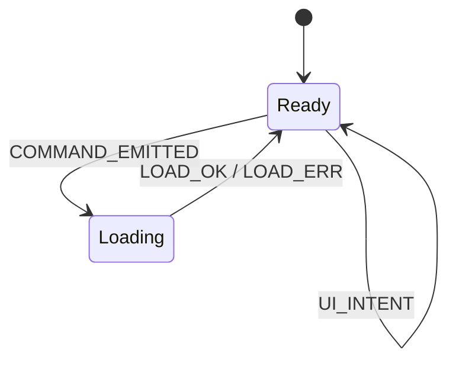
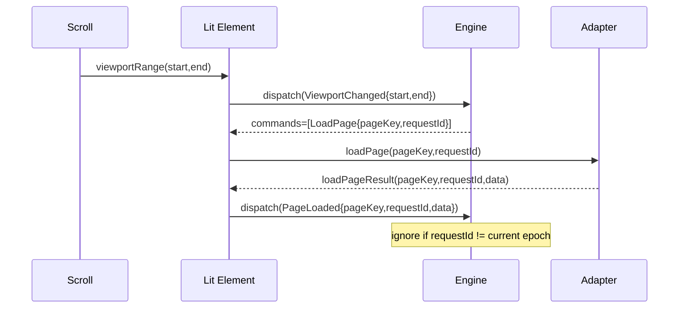

## The process for Lit state flows (fast + predictable)

For a **1M-item tree**, you don’t “build a component and optimize.” You **design the state machine and projection model first**, then the Lit element becomes a thin I/O shell around it.

### 1) Start with the flow diagram you will not violate

This is the backbone (same idea as your guided plan, just swapping Angular → Lit):

```mermaid
flowchart LR
  UI[DOM] --> EL[tree-explorer]
  EL -->|dispatch(intent)| ENG[TreeEngine (@tree-core)]
  ENG -->|selectors snapshot| EL
  ENG -->|commands| EL
  EL -->|adapter calls| AD[TreeAdapter (domain boundary)]
  AD -->|results| EL -->|dispatch(completion)| ENG
  EL --> RENDER[Virtual window render]
```

**Rule:** the Lit element never mutates “nodes.” It only **dispatches intents**, executes **commands**, and renders **derived outputs**.

---

### 2) Produce 3 diagrams (minimum) before writing code

You want predictability? You need the diagrams to force it.

#### A) State machine (macro)

Keep it boring: one state tree, event-driven, command-emitting.



Don’t over-model micro-states. Put complexity in **sub-states per module** (paging, projection, selection, nav), not in a giant global chart.

#### B) Sequence diagrams for the 4 hardest flows

* scroll → range → page-aware loads
* expand/collapse while requests inflight
* filter change while scrolling (invalidations)
* keyboard navigation across unloaded ranges

Example (scroll + load + stale protection):



#### C) “Intent → event → state touched → outputs” mapping table

This prevents accidental side effects and hidden state.

| UI intent     | Engine event      | Modules touched               | Outputs                      | Commands                 |
| ------------- | ----------------- | ----------------------------- | ---------------------------- | ------------------------ |
| scroll range  | `ViewportChanged` | paging, projection            | `windowSpec`, `totalCount`   | `LoadPage[]`             |
| expand toggle | `ToggleExpand`    | projection, paging            | `totalCount`, row access     | `LoadChildren?`          |
| filter change | `FilterUpdated`   | filtering, projection, paging | new `totalCount`             | `LoadPage[]` (new epoch) |
| keydown       | `NavKey`          | navigation, selection         | `activeId`, `scrollToIndex?` | none                     |

---

### 3) Define the **only** state you keep (canonical) vs derived

For 1M items, **state design is performance design**.

#### Canonical state (engine)

Keep it compact, indexable, and mutation-friendly internally (but deterministic externally).

* `config` (toggles)
* `expansion` (bitset / set of expanded ids)
* `selection` (set or single id)
* `active` (focused id + active index)
* `filterQuery` + `filterEpoch`
* `projectionIndex` (NOT “visible rows array”)

  * enough structure to answer:

    * `totalVisibleCount()`
    * `nodeAtVisibleIndex(i)`
    * `visibleIndexOfNode(id)` (optional)
* `paging`

  * loaded page registry, in-flight requests, request epoch/versioning

#### Derived outputs (selectors)

* `totalCount`
* `windowRange` (start/end/overscan)
* `rowAt(i)` **as a function**, not a giant array
* `rowKeyAt(i)` for DOM reuse
* `aria` + `tabIndex/focus` model

**Tell it like it is:** if you materialize a `visibleRows: Row[]` array for big trees, you will eventually lose (GC + rebuild costs + invalidation bugs).

---

### 4) Model async as commands, not side effects

Engine is “pure-ish”: reducer produces `{nextState, commands}`.

* **Reducer**: deterministic, no I/O, no timers.
* **Host (Lit element)**: executes commands via adapter, dispatches completions.
* **Stale response handling**: `epoch` + `requestId`.

  * Any filter/expand that changes projection semantics increments `epoch`.
  * Completions with old epoch are ignored.

This is the core of “predictable behaviors in every scenario.”

---

### 5) The Lit-specific state flow (fast rendering)

Lit is great, but you must avoid making it track huge reactive structures.

#### Recommended pattern

* Engine is an external store:

  * `dispatch(event)`
  * `getSnapshot()` (cheap)
  * `subscribe(listener)` (batched)

* Lit element holds **only**:

  * a small `@state()` snapshot reference (or version number)
  * viewport metrics (scrollTop, height, rowHeight)

On store change:

* schedule a **single** update per frame (or microtask)

  * do not re-render per event during scroll

#### Rendering strategy for 1M rows

* Fixed row height. Don’t negotiate this if you care about speed.
* Custom “virtual window”:

  * compute `(start,end)` from scrollTop
  * render only `(end-start)` rows (usually ~100–300)
  * top/bottom spacers simulate total height: `totalCount * rowHeight`

DOM reuse:

* use stable keys: `rowKeyAt(i)` (usually node id)

---

### 6) Virtualization + page-aware range loading (design, not guesswork)

You need two separate computations:

1. **viewport → visible index range**
2. **visible index range → required pages**

Hard requirement for correctness: range changes can happen faster than loads complete.

#### Page model (works well)

* page key = `floor(visibleIndex / pageSize)`
* pages represent **projection slots**, not “children arrays”
* `ViewportChanged(start,end)`:

  * compute `neededPages = pagesCovering(start,end,overscan)`
  * emit `LoadPage` for missing/unloaded pages
  * dedupe via `inFlight` + `loaded` registries
  * invalidate everything on `epoch` changes

---

## What to design first (order matters)

1. **Event catalog** (all intents + completions)
2. **Canonical state shape** (small, indexable)
3. **Invariants** (what must never break)
4. **Projection index strategy** (the real performance lever)
5. **Paging/range module** (dedupe + epoch)
6. **Lit host contract** (commands executor + viewport reporter)
7. **Only then** write the Lit component and DOM rendering

---

## Non-negotiable invariants (write them down and test them)

* Engine is the only place that changes expansion/selection/projection.
* No completion can mutate state if `requestId/epoch` is stale.
* Projection answers (`totalCount`, `nodeAt(i)`) are consistent within a single snapshot.
* Range-loading is idempotent: same range events do not multiply requests.
* Filtering/expansion changes invalidate paging deterministically.

---

## Testing that actually proves “predictable for every scenario”

If you don’t do this, you will ship race bugs.

1. **Fuzz tests** (property-based style):

* generate random sequences of events:

  * scroll ranges, expand/collapse, filter updates, key nav, selection toggles
* randomly interleave async completions (including stale)
* assert invariants after every step

2. **Determinism test**

* same event stream must produce identical snapshots + commands

3. **Perf tests (engine only)**

* measure time for `ViewportChanged` at high frequency:

  * target: sub-millisecond reducer work for typical window sizes
* ensure allocations per event are bounded (no array explosions)

---

## Blunt guidance for 1M items

* If your projection model requires “flattening the tree” as an array on every change, you will not hit “absolutely fast.”
* Fixed row height + window rendering + command-based async + epoch invalidation is the reliable path.
* Lit’s job is not state management; it’s rendering a small window and translating DOM events into engine events.

If you want, I can provide a concrete **Lit host contract** (events you dispatch from the element + commands you execute) and a **projection index design** that supports `nodeAt(i)` without building a full visible array.
