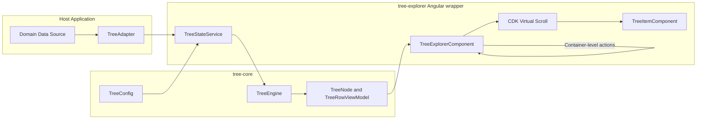
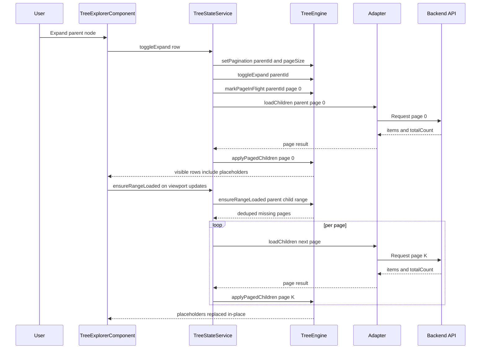
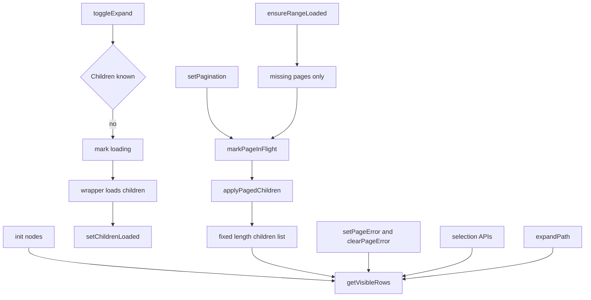

# Architecture

## Philosophy

1. Start from the data source and UX constraints.
2. Keep adapters responsible for domain projection and backend protocol details.
3. Keep `TreeEngine` responsible for state, flattening, and load orchestration.
4. Keep UI wrappers thin and deterministic.
5. Treat placeholders as first-class nodes for virtualization correctness.

## Component Diagram

## I/O Contracts

- Input to wrappers:
  - `data`, `adapter`, `config`
- Input to engine:
  - mapped `TreeNode` graph, pagination metadata, expand/select/range events
- Output from engine:
  - `TreeRowViewModel[]`, loading/error/select state
- Output from wrappers:
  - UI interaction events for host application

## Adapter Boundaries

- Allowed in adapter:
  - backend request shapes
  - ID/label/icon mapping
  - pagination mode and page size
- Not allowed in adapter:
  - UI layout/state logic
- Not allowed in wrapper/core:
  - app-specific domain policy

## Sequence: Expand + Page-Aware Loading

## TreeEngine API Map

## Filtering Architecture (Current)

Current filtering is an adapter-owned visibility predicate, not a query pipeline:

- Filtering logic lives in `adapter.isVisible(data)`.
- `TreeEngine.getVisibleRows()` calls `adapter.isVisible` per non-placeholder row and skips rows that return `false`.
- No filter input exists in `TreeEngine`, `TreeStateService`, or `TreeExplorerComponent` (`setFilter`, `filterSignal`, and query state are absent).
- Placeholders always remain visible to preserve virtualization geometry.

Data flow today:

1. Host app updates adapter/data (often via new adapter object or rebuilt source data).
2. `TreeStateService` bumps version and recomputes `visibleRows`.
3. `TreeEngine` flattens expanded nodes, then applies `adapter.isVisible` while building row view models.
4. Virtual scroll renders that derived list and triggers range loading from rendered rows.

## Proposed Filtering Model

### Modes

- Client-side mode:
  - Evaluate filters over currently loaded nodes only.
- Hybrid mode:
  - Filter loaded nodes first, with optional adapter-triggered deep loading for likely matches.
- Server-side mode:
  - Adapter/API returns already-filtered children, including pagination metadata.

### Scope

- Row predicate (fast path):
  - `nodeVisible(node, filterCtx)` for cheap checks over already-loaded data.
- Structured query (tree-level):
  - `FilterQuery` with text, tokens, fields, and flags.
- Adapter extension points:
  - `getSearchText(domain)` or `matches(domain, query)`.
  - Optional `highlightRanges(label, query)`.

### Behavior Decisions (Configurable)

- Include parent rows when any descendant matches.
- Auto-expand ancestor chain for matching descendants.
- Selection policy during filtering:
  - keep selection,
  - clear filtered-out selection,
  - keep selection but disable actions on hidden rows.
- Incremental evaluation:
  - debounce input,
  - cancel stale async work,
  - bound recomputation to changed subtrees where possible.

### Core Contract Recommendation

Introduce a core-level filter contract while preserving existing adapter visibility hooks:

- `setFilter(filterQuery)`
- `clearFilter()`
- `getFilteredFlatList()`

Backward-compatible migration path:

1. Keep `adapter.isVisible(data)` supported.
2. Treat legacy `isVisible` as an implicit filter predicate when no `FilterQuery` is configured.
3. Deprecate direct UI-layer filtering patterns after equivalent core APIs exist.

## References

- Filtering assessment and risks: `docs/filtering-review.md`
- Delivery roadmap and adapter techniques: `docs/next-steps.md`

## Performance Design Rules

- Stable row IDs are mandatory.
- Placeholder nodes must be cheap and immutable by default.
- Range loading must dedupe in-flight requests by `(parentId,pageIndex)`.
- Virtualization uses fixed row heights and fixed-length lists to preserve scroll metrics.
