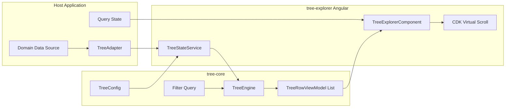
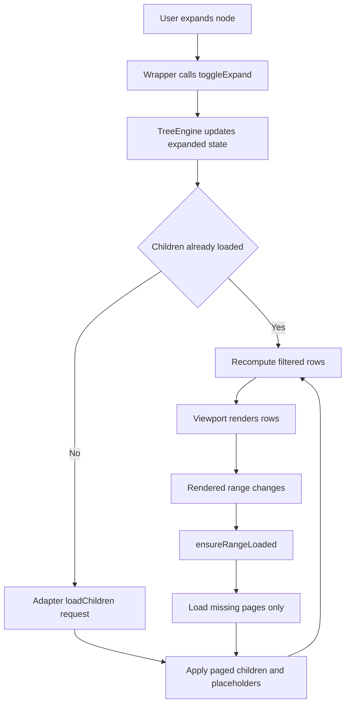
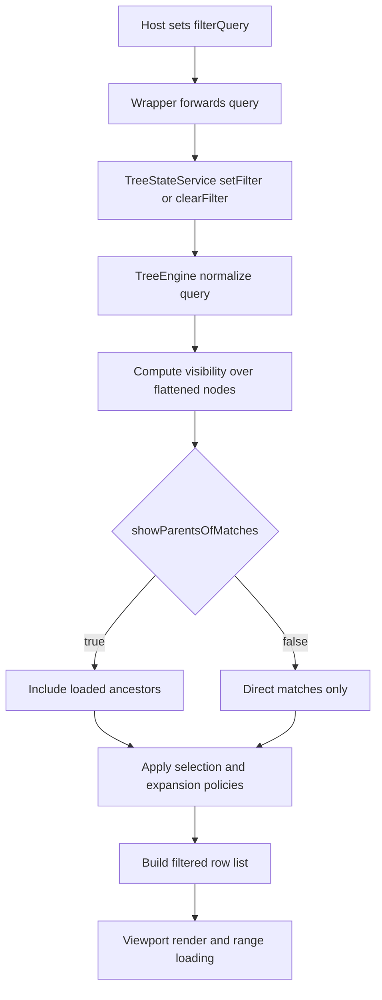
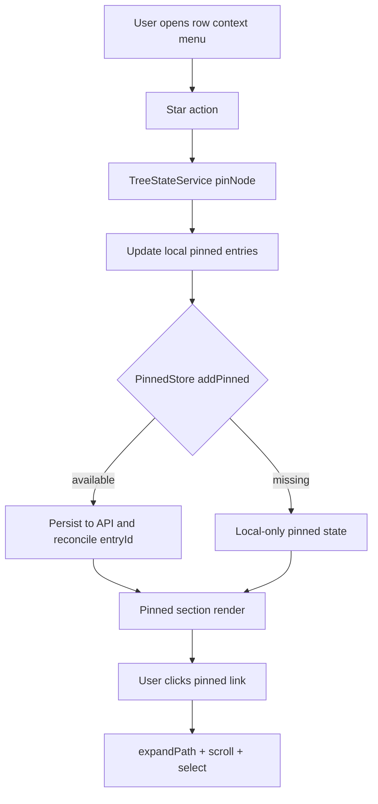

# Architecture

## Philosophy

1. Start from data source constraints and UX requirements.
2. Keep domain policy in adapters.
3. Keep orchestration and state transitions in `TreeEngine`.
4. Keep wrappers thin and deterministic.
5. Preserve virtualization invariants under loading and filtering.

## Core Concepts

- `TreeEngine`: source of truth for tree state transitions.
- `TreeNode`: normalized node state held by `TreeEngine`.
- `TreeRowViewModel`: UI-facing row model emitted by `TreeEngine`.
- `TreeAdapter`: domain boundary for mapping, matching, and loading.
- `Filtering`: query-driven visibility pipeline with configurable policies.
- `Page-Aware Virtual Scrolling`: placeholder-backed paging that preserves viewport geometry.
- `Pinned Items`: optional root-level shortcut section backed by stable pinned entry records.

## Reading Order

1. Understand system boundaries.
2. Follow filtering flow.
3. Follow page-aware loading flow.
4. Use related docs for risk/roadmap details.

## System Overview

## Boundaries

- Adapter owns:
  - domain mapping and IDs
  - backend protocol and query translation
  - matching semantics (`matches`, `getSearchText`, `highlightRanges`)
- Engine owns:
  - node graph state
  - flattening, selection, loading, error states
  - filtering lifecycle (`setFilter`, `clearFilter`, `reapplyFilter`)
  - placeholder-aware page orchestration
- Wrapper owns:
  - rendering and viewport integration
  - presentational text highlighting (`TreeHighlightMatchPipe`)
  - events and interaction wiring

## Expand and Page-Aware Loading

## Filtering Data Flow

## Pinned Items Data Flow

## Filtering Contract

- Core lifecycle:
  - `setFilter(filterQuery)`
  - `clearFilter()`
  - `reapplyFilter(adapter)`
  - `getFilteredFlatList(adapter, config)`
  - `selectRange(fromId, toId, adapter?, config?)`
- Filtering mode contract:
  - `client`: core evaluates query matching over loaded rows
  - `hybrid`: core evaluates loaded rows; wrappers may load deeper matches
  - `server`: adapter/API owns filtering; core skips query match filtering
- Backward compatibility:
  - `getVisibleRows()` delegates to `getFilteredFlatList()`
  - `adapter.isVisible` remains supported as baseline visibility gating

## Performance Rules

- Stable IDs are mandatory for selection and virtualization.
- Placeholder IDs must be deterministic per `(parentId, index)`.
- Never run filtering logic in row components.
- Keep range loading deduped by `(parentId, pageIndex)`.
- Keep filter recomputation bounded to state/query changes.

## Related Docs

- Filtering review: [docs/filtering-review.md](./filtering-review.md)
- Page-aware loading: [docs/page-aware-virtual-scroll.md](./page-aware-virtual-scroll.md)
- Pinned items: [docs/pinned-items.md](./pinned-items.md)
- Quality report: [docs/quality-report.md](./quality-report.md)
- Roadmap: [docs/next-steps.md](./next-steps.md)
