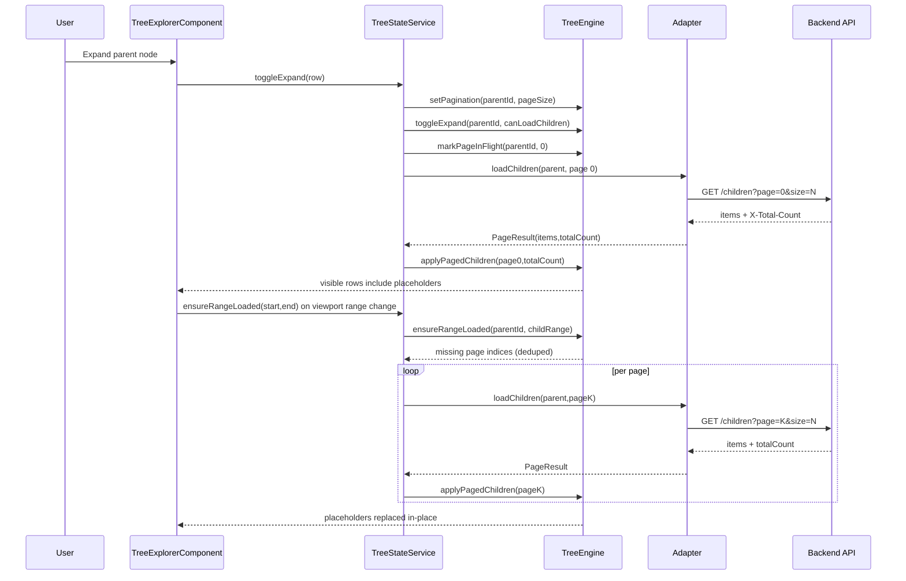

# Architecture

## Philosophy

1. Start from the data source and UX constraints.
2. Keep adapters responsible for domain projection and backend protocol details.
3. Keep `TreeEngine` responsible for state, flattening, and load orchestration.
4. Keep UI wrappers thin and deterministic.
5. Treat placeholders as first-class nodes for virtualization correctness.

## Component Diagram

```mermaid
flowchart LR
  subgraph App
    DS[Domain Data Source]
    ADP[TreeAdapter]
  end

  subgraph Core[@tree-core]
    ENG[TreeEngine]
    CFG[TreeConfig]
    TYPES[TreeNode / TreeRowViewModel]
  end

  subgraph Angular[@tree-explorer]
    C[TreeExplorerComponent]
    S[TreeStateService]
    R[TreeItemComponent]
    VS[CDK Virtual Scroll]
  end

  DS --> ADP
  ADP --> S
  CFG --> S
  S --> ENG
  ENG --> TYPES
  TYPES --> C
  C --> VS
  VS --> R
  C -->|container-level menu/actions| C
```

## I/O Contracts

- Input to wrappers:
  - `data`, `adapter`, `config`
- Input to engine:
  - mapped `TreeNode` graph, pagination metadata, expand/select/range events
- Output from engine:
  - `TreeRowViewModel[]`, loading/error/select state
- Output from wrappers:
  - UI interaction events for host application

## Adapter Boundaries

- Allowed in adapter:
  - backend request shapes
  - ID/label/icon mapping
  - pagination mode and page size
- Not allowed in adapter:
  - UI layout/state logic
- Not allowed in wrapper/core:
  - app-specific domain policy

## Sequence: Expand + Page-Aware Loading



## TreeEngine API Map

```mermaid
flowchart TD
  A[init(nodes)] --> B[getVisibleRows]
  C[toggleExpand] --> D{children known?}
  D -- no --> E[mark loading]
  E --> F[wrapper loads children]
  F --> G[setChildrenLoaded]

  H[setPagination] --> I[markPageInFlight]
  I --> J[applyPagedChildren]
  J --> K[fixed-length childrenIds]
  K --> B

  L[ensureRangeLoaded] --> M[missing pages only]
  M --> I

  N[setPageError/clearPageError] --> B
  O[selection APIs] --> B
  P[expandPath] --> B
```

## Performance Design Rules

- Stable row IDs are mandatory.
- Placeholder nodes must be cheap and immutable by default.
- Range loading must dedupe in-flight requests by `(parentId,pageIndex)`.
- Virtualization uses fixed row heights and fixed-length lists to preserve scroll metrics.
