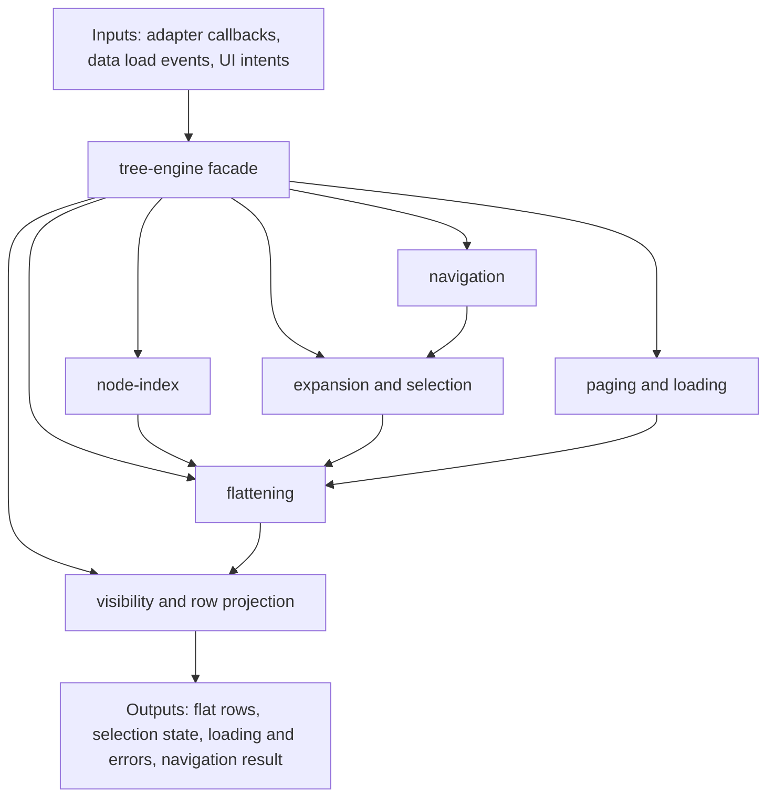
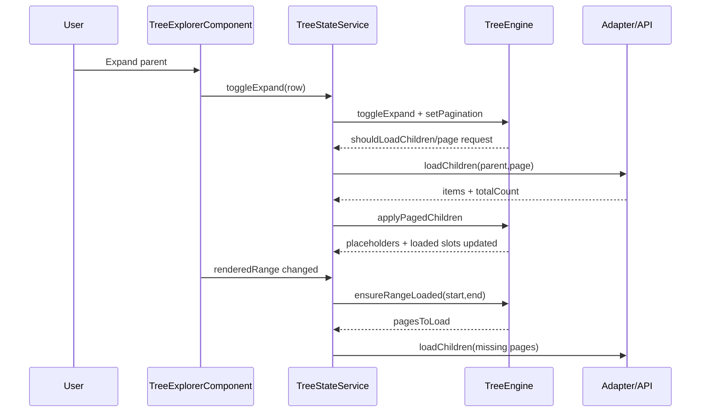
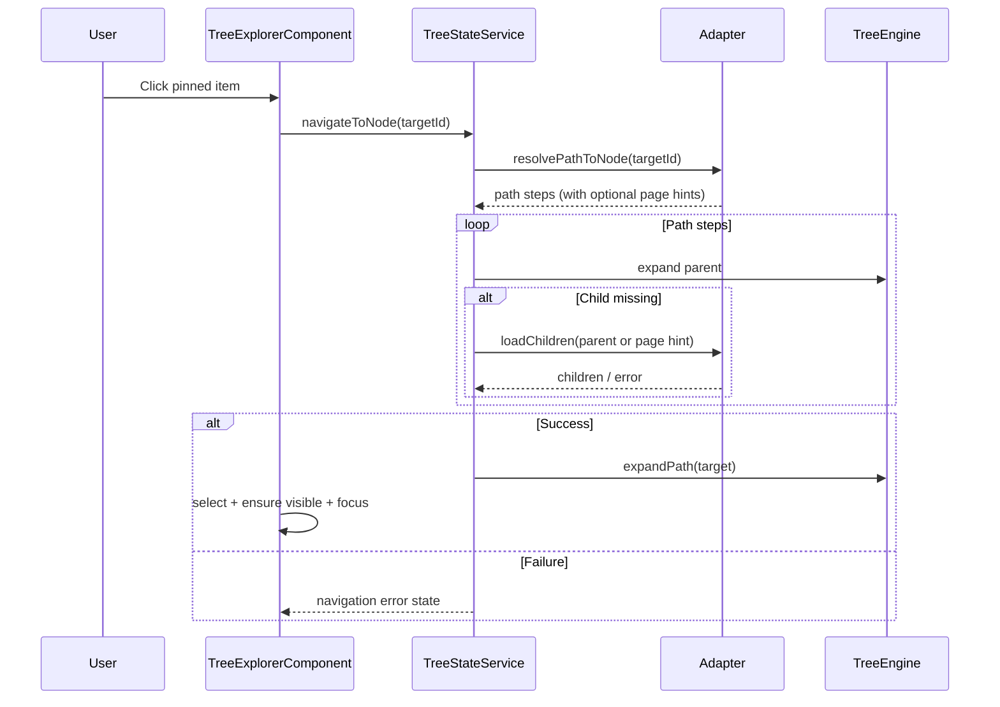

# Architecture

> Don’t paste this into your app. Read it, adapt it, and decide what you’re actually building.

## 1) Getting started

1. Define a `TreeAdapter` that owns ID mapping, labels, loading, filtering semantics, and optional navigation path resolution.
2. Feed data + adapter into `TreeExplorerComponent` (Angular wrapper).
3. Let wrapper/service delegate state transitions to `TreeEngine` in `@tree-core`.
4. Validate behavior with Storybook:
   - `Tree/Errors & edge cases`
   - `Tree/Virtual scroll/Page aware`
   - `Tree/Basic Usage`

Minimal shape:

```ts
const adapter: TreeAdapter<Node> = {
  getId: (source) => source.id,
  getLabel: (data) => data.name,
  hasChildren: (data) => !!data.hasChildren,
  loadChildren: (node) => api.loadChildren(node.id),
};
```

## 2) Purpose

- Keep domain/API logic at the adapter boundary.
- Keep orchestration and state transitions in `TreeEngine`.
- Keep wrappers rendering-focused and virtualization-safe.
- Support large trees (100k+ rows) without per-row heavy allocations.
- Preserve centralized context-menu ownership in `TreeExplorerComponent`.

## 3) Feature overview

### System boundaries

```mermaid
flowchart LR
  subgraph APP[Host App]
    DS[Domain Data Source]
    ADP[TreeAdapter]
    UI[Filter and Interaction Inputs]
  end

  subgraph CORE[@tree-core]
    ENG[TreeEngine Facade]
    IDX[Node Index]
    FLAT[Flattening]
    EXP[Expansion]
    SEL[Selection]
    PAGE[Paging]
    LOAD[Loading and Errors]
    VIS[Visibility and Row Projection]
    NAV[Navigation]
  end

  subgraph NG[@tree-explorer]
    CMP[TreeExplorerComponent]
    SVC[TreeStateService]
    VP[CDK Virtual Scroll]
  end

  DS --> ADP
  UI --> CMP
  ADP --> SVC
  CMP --> SVC
  SVC --> ENG
  ENG --> IDX
  ENG --> FLAT
  ENG --> EXP
  ENG --> SEL
  ENG --> PAGE
  ENG --> LOAD
  ENG --> VIS
  ENG --> NAV
  ENG --> SVC
  SVC --> CMP
  CMP --> VP
```

### TreeEngine module data flow



### Expand/load/page sequence



### Pinned async navigation sequence



## 4) API overview

### Core contracts

| Contract | Key methods/fields | Meaning |
|---|---|---|
| `TreeAdapter<TSource,T>` | `getId`, `getLabel`, `loadChildren`, `getPagination`, `matches`, `isLeaf`, `resolvePathToNode` | Domain boundary and async loading/matching policy owner |
| `TreeEngine<T>` | `toggleExpand`, `applyPagedChildren`, `setFilter`, `getFilteredFlatList`, `selectRange` | State machine for transitions and row outputs |
| `TreeConfig<T>` | `selection`, `virtualization`, `filtering`, `pinned`, `actions` | Wrapper/runtime behavior policy |
| `TreeLoadError` | `scope`, `nodeId`, `pageIndex`, `reason` | Standardized root/children/navigation failure payload |

### `isLeaf` precedence

1. `adapter.isLeaf(data, ctx)` when it returns boolean.
2. `node.isLeaf` when present.
3. Default heuristic:
   - loaded `childrenIds` length
   - adapter `hasChildren`
   - load capability fallback.

### Async pinned navigation extension

- Optional adapter hook:
  - `resolvePathToNode(targetId) -> { targetId, steps[] }`
- Steps may include pagination hints for paged parents.
- Wrapper/service uses this to load missing branches deterministically.

## 5) Edge cases & failure modes

- Initial root load failure:
  - wrapper emits `TreeLoadError` with `scope='root'`.
- Page-aware load failure:
  - page-level errors are tracked; retries target failed pages only.
- Navigation path unavailable:
  - emits `scope='navigation'` with reason `path-unavailable`.
- Navigation path resolution failure:
  - emits `scope='navigation'` with reason `path-resolution-failed`.
- Navigation branch load failure:
  - emits `scope='navigation'` with reason `load-failed`.
- Missing node after loads:
  - emits `scope='navigation'` with reason `not-found`.

## 6) Recipes

- If backend owns filtering:
  - set `filtering.mode='server'` and keep `adapter.matches` optional.
- If paged branch needs direct target navigation:
  - return page hints from `resolvePathToNode`.
- If you need strict leaf semantics:
  - implement `adapter.isLeaf(data, ctx)` and keep it deterministic.
- If you need pinned persistence:
  - use `TreePinnedStore` hooks (`loadPinned`, `addPinned`, `removePinned`, `reorderPinned`).
- Storybook references:
  - `packages/tree-explorer/src/stories/tree-explorer.errors-edge-cases.stories.ts`
  - `packages/tree-explorer/src/stories/tree-explorer.page-aware.stories.ts`
  - `packages/tree-explorer/src/stories/tree-explorer.advanced.stories.ts`

## 7) Non-goals / pitfalls

- Do not put domain/API branching inside row components.
- Do not treat wrapper events as persistence logic; keep that in adapter/store.
- Do not rely on unstable IDs; virtualization and selection correctness depend on stable IDs.
- Do not bypass `TreeEngine` state transitions with direct node mutations.
- Do not assume pinned navigation can resolve unloaded targets without `resolvePathToNode`.
