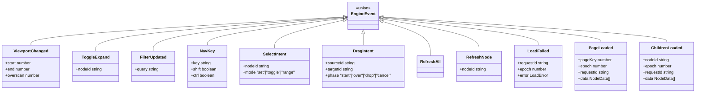

# Diagrams — Lit Tree Explorer + TreeEngine

> **Design rule:** each diagram covers ONE flow, max ~8 nodes, short labels.
> Consistent names: `TreeExplorerElement`, `TreeEngine`, `TreeAdapter`, `TreeItem`, `CommandRunner`.

---

## A) End-to-end architecture flow

### A1 — Intent dispatch path


### A2 — Command execution path (with retry)


### A3 — Context menu ownership


---

## B) State machine — macro lifecycle


> Notes:
> - Config is **frozen at Init**. No `ConfigChanged` event. To change config, destroy + recreate.
> - `STALE_COMPLETION` = epoch mismatch → silently discarded (warn only on error completions).
> - `ALL_DONE` = `inFlight.size === 0` after processing completion or epoch bulk-clear.
> - `EPOCH_BUMP` on: `FilterUpdated`, `ToggleExpand`, `RefreshAll`, `RefreshNode`. Not on scroll/select/nav.
> - `RETRY`: CommandRunner auto-retries once on adapter failure; 2nd failure → error state on node.

---

## C) Scroll → page load → stale ignore


---

## D) Expand/collapse while inflight


---

## E) Filter change while scrolling


---

## F) Keyboard navigation


---

## G) Engine module boundary map

### G1 — Event routing to modules


### G2 — Module dependencies


### G3 — Module → outputs


---

## H) Type diagram

### H1 — Adapter & config


### H2 — Events & commands



### H3 — State & selectors


---

## Deliverable 2 — Implementation example

### 2.1) Core types (`@tree-core`)

```ts
// ── Adapter contract ──────────────────────────────────────────
export interface TreeAdapter<T = unknown> {
  getId(node: T): string;
  getLabel(node: T): string;
  getIcon?(node: T): string | null;
  isExpandable(node: T): boolean;
  getRoots(): Promise<T[]>;
  getChildren(parentId: string): Promise<T[]>;
  loadPage?(pageKey: number, filter?: string): Promise<PageResult<T>>;
  filterMatch?(node: T, query: string): boolean;
  resolvePath?(id: string): Promise<string[]>;
}

export interface PageResult<T> {
  items: T[];
  totalCount: number;
}

// ── Config toggles ───────────────────────────────────────────
export interface TreeConfig {
  virtualScroll: boolean;
  pageAware: boolean;
  pageSize: number;
  overscan: number;
  rowHeight: number;
  selectionMode: 'none' | 'single' | 'multi';
  contextMenu: boolean;
  pinnedItems: boolean;
  keyboardNav: boolean;
}

// ── Events (intent + completion) ─────────────────────────────
export type EngineEvent =
  | { type: 'Init'; config: TreeConfig }
  | { type: 'Destroy' }
  | { type: 'ViewportChanged'; start: number; end: number; overscan: number }
  | { type: 'ToggleExpand'; nodeId: string }
  | { type: 'FilterUpdated'; query: string }
  | { type: 'NavKey'; key: string; shift: boolean; ctrl: boolean }
  | { type: 'SelectIntent'; nodeId: string; mode: 'set' | 'toggle' | 'range' }
  | { type: 'ContextMenuOpen'; nodeId: string | null }
  | { type: 'ConfigChanged'; patch: Partial<TreeConfig> }
  | { type: 'PageLoaded'; pageKey: number; epoch: number; requestId: string; data: unknown[]; totalCount?: number }
  | { type: 'ChildrenLoaded'; nodeId: string; epoch: number; requestId: string; data: unknown[] };

// ── Commands (side-effects for host to execute) ──────────────
export type EngineCommand =
  | { type: 'LoadPage'; pageKey: number; epoch: number; requestId: string; filter?: string }
  | { type: 'LoadChildren'; nodeId: string; epoch: number; requestId: string }
  | { type: 'ScrollTo'; index: number }
  | { type: 'FocusNode'; nodeId: string };

// ── Selector outputs ─────────────────────────────────────────
export interface SelectorOutputs {
  totalCount: number;
  rowAt(i: number): RowDescriptor | null;
  rowKeyAt(i: number): string;
  activeId: string | null;
  selectedIds: ReadonlySet<string>;
  scrollToIndex: number | null;
  contextTargetId: string | null;
}

export interface RowDescriptor {
  id: string;
  label: string;
  icon: string | null;
  depth: number;
  expanded: boolean;
  expandable: boolean;
  selected: boolean;
  active: boolean;
}
```

### 2.2) `createEngine()` sketch

```ts
// @tree-core/engine.ts — reducer + store
export interface EngineStore {
  dispatch(event: EngineEvent): EngineCommand[];
  getSnapshot(): SelectorOutputs;
  subscribe(listener: () => void): () => void;
}

export function createEngine(config: TreeConfig): EngineStore {
  // Config is frozen at creation — no runtime mutation
  const frozenConfig = Object.freeze({ ...config });
  let state = initState(frozenConfig);
  const listeners = new Set<() => void>();

  return {
    dispatch(event) {
      const { nextState, commands } = reduce(state, event);
      // ¹ reduce is pure: (state, event) → { nextState, commands }
      if (nextState !== state) {
        state = nextState;
        // batch notify on microtask
        queueMicrotask(() => listeners.forEach(fn => fn()));
      }
      return commands;
    },

    getSnapshot() {
      return deriveSelectors(state);
      // ² selectors: totalCount, rowAt(i), activeId, etc.
      //   rowAt(i) is a function — no materialized array.
      //   page-aware mode: lazy projection. Non-page-aware: materialized flat index.
    },

    subscribe(listener) {
      listeners.add(listener);
      return () => listeners.delete(listener);
    },
  };
}
```

### 2.3) Lit element skeleton (`@tree-explorer`)

```ts
// tree-explorer-element.ts
import { LitElement, html, css, nothing } from 'lit';
import { customElement, property, state } from 'lit/decorators.js';
import { repeat } from 'lit/directives/repeat.js';
import type {
  TreeAdapter, TreeConfig, EngineCommand, EngineEvent,
  EngineStore, SelectorOutputs, RowDescriptor, LoadError,
} from '@anthropic-ai/tree-core';
import { createEngine } from '@anthropic-ai/tree-core';

@customElement('tree-explorer')
export class TreeExplorerElement extends LitElement {

  /* ── Light DOM rendering (no shadow DOM style constraints) ── */
  override createRenderRoot() { return this; }

  /* ── Public API (set by consuming app, frozen after init) ── */
  @property({ attribute: false }) adapter!: TreeAdapter;
  @property({ attribute: false }) config!: TreeConfig;

  /* ── Internal ── */
  @state() private _snap!: SelectorOutputs;
  private _engine!: EngineStore;
  private _unsub?: () => void;
  private _filterTimer?: ReturnType<typeof setTimeout>;

  /* ── Lifecycle ── */
  connectedCallback() {
    super.connectedCallback();
    this._engine = createEngine(this.config); // config frozen inside
    this._unsub = this._engine.subscribe(() => {
      this._snap = this._engine.getSnapshot();
    });
    // Init always emits LoadRoots
    this._runCommands(this._engine.dispatch({ type: 'Init', config: this.config }));
    this._snap = this._engine.getSnapshot();
  }

  disconnectedCallback() {
    super.disconnectedCallback();
    this._unsub?.();
    this._engine.dispatch({ type: 'Destroy' });
  }

  /* ── Public methods for app integration ── */
  refresh() { this._dispatch({ type: 'RefreshAll' }); }
  refreshNode(nodeId: string) { this._dispatch({ type: 'RefreshNode', nodeId }); }

  /* ── Dispatch helper + DOM event emission ── */
  private _dispatch(event: EngineEvent) {
    const cmds = this._engine.dispatch(event);
    this._emitDOMEvent(event);
    this._runCommands(cmds);
  }

  private _emitDOMEvent(event: EngineEvent) {
    const map: Record<string, string> = {
      SelectIntent: 'tree-select',
      ToggleExpand: 'tree-expand',
      ContextMenuOpen: 'tree-contextmenu',
    };
    const name = map[event.type];
    if (name) this.dispatchEvent(new CustomEvent(name, { detail: event, bubbles: true }));
  }

  /* ── Command runner (with auto-retry once on failure) ── */
  private async _runCommands(cmds: EngineCommand[]) {
    for (const cmd of cmds) {
      switch (cmd.type) {
        case 'LoadRoots': {
          try {
            const roots = await this.adapter.getRoots();
            this._dispatch({
              type: 'ChildrenLoaded', nodeId: '__root__',
              epoch: cmd.epoch, requestId: cmd.requestId, data: roots,
            });
          } catch (e) {
            this._handleLoadError(cmd, { scope: 'root', reason: String(e) });
          }
          break;
        }
        case 'LoadPage': {
          try {
            const result = await this.adapter.loadPage!(cmd.pageKey, cmd.filter);
            this._dispatch({
              type: 'PageLoaded', pageKey: cmd.pageKey,
              epoch: cmd.epoch, requestId: cmd.requestId,
              data: result.items, totalCount: result.totalCount,
            });
          } catch (e) {
            this._handleLoadError(cmd, { scope: 'page', pageKey: cmd.pageKey, reason: String(e) });
          }
          break;
        }
        case 'LoadChildren': {
          try {
            const children = await this.adapter.getChildren(cmd.nodeId);
            this._dispatch({
              type: 'ChildrenLoaded', nodeId: cmd.nodeId,
              epoch: cmd.epoch, requestId: cmd.requestId, data: children,
            });
          } catch (e) {
            this._handleLoadError(cmd, { scope: 'children', nodeId: cmd.nodeId, reason: String(e) });
          }
          break;
        }
        case 'ExecuteDrop': {
          try {
            await this.adapter.executeDrop!(cmd.sourceId, cmd.targetId);
            this.dispatchEvent(new CustomEvent('tree-drop', {
              detail: { sourceId: cmd.sourceId, targetId: cmd.targetId }, bubbles: true,
            }));
            this._dispatch({ type: 'RefreshNode', nodeId: cmd.targetId });
          } catch { /* drop failed, no state change */ }
          break;
        }
        case 'ScrollTo':
          this._scrollContainer()!.scrollTop = cmd.index * this.config.rowHeight;
          break;
        case 'FocusNode':
          this.querySelector(`#${CSS.escape(cmd.nodeId)}`)?.focus();
          break;
      }
    }
  }

  /* Auto-retry once; on 2nd failure dispatch LoadFailed */
  private _retryMap = new Map<string, number>();
  private async _handleLoadError(cmd: EngineCommand & { epoch: number; requestId: string }, error: LoadError) {
    const attempts = (this._retryMap.get(cmd.requestId) ?? 0) + 1;
    this._retryMap.set(cmd.requestId, attempts);
    if (attempts < 2) {
      await this._runCommands([cmd]); // retry once
    } else {
      this._retryMap.delete(cmd.requestId);
      console.warn('[tree-explorer] load failed after retry:', error);
      this._dispatch({ type: 'LoadFailed', requestId: cmd.requestId, epoch: cmd.epoch, error });
    }
  }

  /* ── Filter with debounce ── */
  updateFilter(query: string) {
    clearTimeout(this._filterTimer);
    this._filterTimer = setTimeout(() => {
      this._dispatch({ type: 'FilterUpdated', query });
    }, this.config.filterDebounceMs);
  }

  /* ── Virtual-scroll event → engine ── */
  private _onScroll(e: Event) {
    const el = e.target as HTMLElement;
    const start = Math.floor(el.scrollTop / this.config.rowHeight);
    const end = start + Math.ceil(el.clientHeight / this.config.rowHeight);
    this._dispatch({
      type: 'ViewportChanged',
      start, end, overscan: this.config.overscan,
    });
  }

  /* ── Keyboard → engine ── */
  private _onKeydown(e: KeyboardEvent) {
    if (!this.config.keyboardNav) return;
    this._dispatch({
      type: 'NavKey',
      key: e.key, shift: e.shiftKey, ctrl: e.ctrlKey || e.metaKey,
    });
    e.preventDefault();
  }

  /* ── Render ── */
  render() {
    const s = this._snap;
    if (!s) return nothing;

    const totalH = s.totalCount * this.config.rowHeight;
    const container = this._scrollContainer();
    const scrollTop = container?.scrollTop ?? 0;
    const viewH = container?.clientHeight ?? 600;
    const start = Math.max(0, Math.floor(scrollTop / this.config.rowHeight) - this.config.overscan);
    const end = Math.min(s.totalCount, Math.ceil((scrollTop + viewH) / this.config.rowHeight) + this.config.overscan);

    return html`
      <div class="tree-viewport"
           @scroll=${this._onScroll}
           @keydown=${this._onKeydown}
           role="tree"
           aria-activedescendant=${s.activeId ?? nothing}
           tabindex="0">
        <div class="tree-spacer" style="height:${totalH}px">
          ${this._renderRows(s, start, end)}
        </div>
      </div>
    `;
  }

  private _renderRows(s: SelectorOutputs, start: number, end: number) {
    const rows: RowDescriptor[] = [];
    for (let i = start; i < end; i++) {
      const r = s.rowAt(i);
      if (r) rows.push(r);
    }
    return repeat(
      rows,
      r => r.id,
      (r, idx) => html`
        <tree-item
          id=${r.id}
          .row=${r}
          role="treeitem"
          aria-expanded=${r.expandable ? String(r.expanded) : nothing}
          aria-selected=${r.selected}
          aria-level=${r.depth + 1}
          style="position:absolute;top:${(start + idx) * this.config.rowHeight}px;width:100%"
          @expand-toggle=${() => this._dispatch({ type: 'ToggleExpand', nodeId: r.id })}
          @row-click=${() => this._dispatch({ type: 'SelectIntent', nodeId: r.id, mode: 'set' })}
        ></tree-item>
      `,
    );
  }

  private _scrollContainer() {
    return this.querySelector('.tree-viewport') as HTMLElement | null;
  }
}
```

### 2.4) App A — selection ON, context menu ON, drag-drop ON

```ts
// app-a/tree-adapter.ts
import type { TreeAdapter } from '@anthropic-ai/tree-core';

interface OrgNode { id: string; name: string; icon: string; type: string; hasChildren: boolean; }

export const orgAdapter: TreeAdapter<OrgNode> = {
  getId:          (n) => n.id,
  getLabel:       (n) => n.name,
  getIcon:        (n) => n.icon,
  isExpandable:   (n) => n.hasChildren,
  getRoots:       ()  => fetch('/api/org/roots').then(r => r.json()),
  getChildren:    (id) => fetch(`/api/org/${id}/children`).then(r => r.json()),
  filterMatch:    (n, q) => n.name.toLowerCase().includes(q.toLowerCase()),
  canDrop:        (src, tgt) => src !== tgt,
  executeDrop:    (src, tgt) => fetch(`/api/org/move`, {
                    method: 'POST', body: JSON.stringify({ sourceId: src, targetId: tgt }),
                  }).then(() => {}),
};
```

```html
<!-- app-a/index.html -->
<script type="module">
  import '@anthropic-ai/tree-explorer';         // auto-registers <tree-explorer>
  import { orgAdapter } from './tree-adapter.js';

  const el = document.querySelector('tree-explorer');
  el.adapter = orgAdapter;
  el.config  = {
    virtualScroll:    true,
    pageAware:        false,
    pageSize:         100,
    overscan:         10,
    rowHeight:        32,
    maxInFlight:      3,
    filterDebounceMs: 300,
    selectionMode:    'multi',    // ✅ selection ON
    contextMenu:      true,       // ✅ context menu ON
    pinnedItems:      false,      // ❌ pinned OFF
    dragDrop:         true,       // ✅ drag-drop ON
    keyboardNav:      true,
  };

  // Listen for DOM events
  el.addEventListener('tree-select', (e) => console.log('selected:', e.detail));
  el.addEventListener('tree-drop', (e) => console.log('dropped:', e.detail));
</script>
<tree-explorer></tree-explorer>
```

### 2.5) App B — selection OFF, pinned ON, page-aware ON

```ts
// app-b/tree-adapter.ts
import type { TreeAdapter, PageResult } from '@anthropic-ai/tree-core';

interface AssetNode { assetId: string; title: string; childCount: number; }

export const assetAdapter: TreeAdapter<AssetNode> = {
  getId:          (n) => n.assetId,
  getLabel:       (n) => n.title,
  isExpandable:   (n) => n.childCount > 0,
  getRoots:       ()  => fetch('/api/assets/roots').then(r => r.json()),
  getChildren:    (id) => fetch(`/api/assets/${id}/children`).then(r => r.json()),
  loadPage:       (pk, f) => fetch(`/api/assets/page/${pk}?q=${f ?? ''}`)
                              .then(r => r.json()) as Promise<PageResult<AssetNode>>,
  filterMatch:    (n, q) => n.title.toLowerCase().includes(q.toLowerCase()),
  resolvePath:    (id) => fetch(`/api/assets/${id}/path`).then(r => r.json()),
};
```

```html
<!-- app-b/index.html -->
<script type="module">
  import '@anthropic-ai/tree-explorer';
  import { assetAdapter } from './tree-adapter.js';

  const el = document.querySelector('tree-explorer');
  el.adapter = assetAdapter;
  el.config  = {
    virtualScroll:    true,
    pageAware:        true,       // ✅ page-aware ON
    pageSize:         200,
    overscan:         20,
    rowHeight:        28,
    maxInFlight:      5,
    filterDebounceMs: 300,
    selectionMode:    'none',     // ❌ selection OFF
    contextMenu:      false,      // ❌ context menu OFF
    pinnedItems:      true,       // ✅ pinned ON
    dragDrop:         false,      // ❌ drag-drop OFF
    keyboardNav:      true,
  };

  // Refresh API for optimistic update pattern
  document.getElementById('refresh-btn')?.addEventListener('click', () => el.refresh());
</script>
<tree-explorer></tree-explorer>
```

> **Cross-app pattern:** each app provides only `adapter` + `config`. No engine wiring, no subclassing, no platform glue. The Lit element + engine handle the rest. Each instance gets its own engine + adapter — safe for multi-tab views.

---

## Deliverable 3 — Decision Log

All decisions are final and traced back to the phase answer that produced them.

| # | Decision | Source | Rationale |
|---|----------|--------|-----------|
| D1 | **Design budget: 500 K items** | P1-Q1 | Memory ceiling and perf tests calibrated to 500K. |
| D2 | **Multiple tree instances share registration, own engine** | P1-Q2, P8-Q4 | `customElements.define` is idempotent for same class; each `<tree-explorer>` instance gets its own engine + adapter. |
| D3 | **All three selection modes: none / single / multi** | P1-Q3 | Configurable via `selectionMode` on `TreeConfig`. |
| D4 | **Filtering lives in adapter; engine owns filter state** | P1-Q4, P2-Q3 | Adapter decides client vs. server filtering. Engine tracks query string + epoch. |
| D5 | **Pinned items persisted per instance within session** | P1-Q5 | Adapter's `resolvePath` is required when `pinnedItems: true`. |
| D6 | **Latency budget: < 500 ms total interaction** | P1-Q6 | Reducer ≤ 2 ms, command execution async; total render < 500 ms. |
| D7 | **No SSR. Pure client-side web component** | P1-Q7 | Engine tested in Vitest (JSDOM/happy-dom), no Node.js runtime dependency. |
| D8 | **Drag-and-drop IN SCOPE** | P1-Q8 | New `DragIntent` event; optional `canDrop`/`executeDrop` on adapter; `dragDrop` config toggle. No reorder. |
| D9 | **Stable unique IDs required; runtime warn on duplicates** | P2-Q1 | Adapter guarantees ID uniqueness. Engine logs a dev-mode warning if duplicate detected. |
| D10 | **`getChildren` may return full or paginated data** | P2-Q2 | `loadPage` is optional. If absent → non-page-aware mode. |
| D11 | **`loadPage` returns `totalCount` every call** | P2-Q4 | `PageResult<T>` includes `totalCount`. Engine uses it for projection. |
| D12 | **`resolvePath` optional; required only when `pinnedItems: true`** | P2-Q5 | Missing `resolvePath` + `pinnedItems: true` → dev-mode assertion error. |
| D13 | **`getIcon`/`getLabel` are synchronous** | P2-Q6 | No async icon resolution. Enforced by return type (no `Promise`). |
| D14 | **`isExpandable` is synchronous** | P2-Q7 | Determined from domain properties, not child count. |
| D15 | **Adapter throws on failure → engine models error as node state** | P2-Q8 | `LoadError` shape: `{ scope, nodeId?, pageKey?, reason }`. `RowDescriptor.status` = `'error'`. |
| D16 | **All events accepted while inflight** | P3-Q1 | Scroll, selection, collapse, expand all processed. Engine never blocks. |
| D17 | **Epoch increments only on structural-change triggers** | P3-Q2 | `FilterUpdated`, `ToggleExpand`, `RefreshAll`, `RefreshNode` bump epoch. Scroll, selection, nav, completions do NOT. |
| D18 | **Stale completions silently discarded** | P3-Q3 | Warning logged only for error completions that arrive stale (for debugging). |
| D19 | **Config frozen at init. No `ConfigChanged` event** | P3-Q4 | `Object.freeze(config)` in `createEngine`. To change config → destroy + recreate element. |
| D20 | **Immutable state invariant after every dispatch** | P3-Q5 | `Object.freeze(state)` in dev mode. CI assertion: `state !== previousState || commands.length === 0`. |
| D21 | **Commands emitted one at a time (no batching)** | P3-Q6 | Exception: pinned navigation emits sequential `LoadChildren` chain. |
| D22 | **ALL_DONE = `inFlight.size === 0`** | P3-Q7 | Checked after every completion processing and after epoch bulk-clear. |
| D23 | **Init always emits `LoadRoots` command** | P3-Q8 | Zero-command init is forbidden. Init → `[LoadRoots]` always. |
| D24 | **Fixed row height is a hard requirement** | P4-Q1 | `rowHeight` in config. No variable-height support. |
| D25 | **Skeleton rows for partially-loaded subtrees** | P4-Q2 | `RowDescriptor.status = 'loading'`. Skeleton row: `id = '__skeleton_${index}'`. |
| D26 | **`nodeAtVisibleIndex` target < 5 ms for 500K** | P4-Q3 | Sub-ms not required. Benchmark CI gate at ≤ 5 ms. |
| D27 | **Dual projection: page-aware → lazy; non-page → materialized** | P4-Q4 | `rowAt(i)` is lazy in page-aware. Flat array materialized for non-page mode. |
| D28 | **Partial rebuild on expand** | P4-Q5 | Re-index from expanded node's position onward. Not full rebuild. |
| D29 | **Projection unaware of filter** | P4-Q7 | Engine orchestrates: filter change → epoch bump → projection rebuilt from filtered data set. |
| D30 | **pageSize configurable 100–500** | P5-Q1 | `TreeConfig.pageSize` validated at init. |
| D31 | **Page boundaries aligned to projection indices** | P5-Q2 | Page key = `Math.floor(projectionIndex / pageSize)`. |
| D32 | **Max 3–5 in-flight pages** | P5-Q3 | `TreeConfig.maxInFlight` (default 3, max 5). Excess requests queued. |
| D33 | **Auto-retry once on failure** | P5-Q4 | Failed load retried once automatically. 2nd failure → `LoadFailed` event → `status: 'error'`. |
| D34 | **Filter debounce at element level (300 ms)** | P5-Q5 | `TreeConfig.filterDebounceMs` (default 300). Element debounces before dispatching `FilterUpdated`. Engine filter change → epoch bump → inflight pages invalidated (stale completions discarded). Does NOT cancel HTTP requests. |
| D35 | **Dedup via inFlight + loaded registries** | P5-Q6 | Request not issued if `inFlight.has(pageKey)` or `loadedPages.has(pageKey)`. |
| D36 | **Optimistic totalCount; explicit refresh events** | P5-Q7 | Engine trusts last-seen `totalCount`. `RefreshAll`/`RefreshNode` for forced reload. |
| D37 | **No prefetching. Overscan handles adjacency** | P5-Q8 | Prefetch adds complexity with minimal gain. Overscan (configurable) is sufficient. |
| D38 | **ARIA: role=tree, role=treeitem, aria-expanded, aria-selected, aria-level, aria-setsize, aria-posinset** | P6-Q1 | Full ARIA tree pattern per WAI-ARIA 1.2. |
| D39 | **ArrowRight on leaf: no-op** | P6-Q2 | Leaf nodes omit `aria-expanded` attribute entirely. |
| D40 | **Shift+Arrow multi-select: deferred** | P6-Q3 | Selection model supports range; keyboard shortcut implementation is lower priority. |
| D41 | **Type-ahead = filter input, not character tree search** | P6-Q4 | No per-character tree walk. Filter input field handles typeahead. |
| D42 | **Focus ring on active row only** | P6-Q5 | Single `:focus-visible` indicator. |
| D43 | **Home/End go to first/last root item; End may trigger LoadPage** | P6-Q6 | If last page unloaded → engine emits LoadPage before scrolling. |
| D44 | **`aria-activedescendant` pattern** | P6-Q7 | Container holds `tabindex=0`. Items have `id` attributes. |
| D45 | **No custom command executors (deferred)** | P7-Q1 | `CommandRunner` stays internal to element. |
| D46 | **No pre/post expand hooks** | P7-Q2 | All transitions through engine events. No app-level lifecycle hooks. |
| D47 | **No plugin/middleware model** | P7-Q4 | Middleware can be added later via `dispatch` wrapper pattern. |
| D48 | **Light DOM rendering** | P7-Q5 | `createRenderRoot()` returns `this`. No shadow DOM style boundary. |
| D49 | **CSS custom properties for theming** | P7-Q6 | Documented property API (e.g., `--tree-row-height`, `--tree-indent`). |
| D50 | **DOM CustomEvents for app integration** | P7-Q7 | `tree-select`, `tree-expand`, `tree-contextmenu`, `tree-drop`. All bubble. |
| D51 | **pnpm workspace ESM package** | P8-Q1 | `@tree-core` is internal pnpm workspace package. Not published to npm. |
| D52 | **Symmetric versioning** | P8-Q2 | `@tree-core` and `@tree-explorer` share version number. |
| D53 | **ESM only** | P8-Q3 | No CJS build. |
| D54 | **Auto-register via `@customElement`** | P8-Q4 | Registration is idempotent. Safe for multi-instance pages. |
| D55 | **Modern browsers only** | P8-Q5 | Chromium 145+, Firefox 147+, Safari 26.3+. |
| D56 | **No Node.js dependency for engine** | P8-Q6 | Tested in Vitest with JSDOM/happy-dom. |
| D57 | **Preset adapters via `@tree-core/presets`** | P8-Q7 | Common adapter factories shipped as a sub-path export. |
| D58 | **No CDN distribution** | P8-Q8 | Internal workspace only. |

---

## Deliverable 4 — API Surface Deltas

Changes relative to the original (pre-phase-answer) API.

### 4.1) TreeAdapter — added

| Member | Type | Why |
|--------|------|-----|
| `canDrop?(src, tgt)` | `boolean` | D8: drag-drop in scope |
| `executeDrop?(src, tgt)` | `Promise<void>` | D8: adapter executes domain-level move |

### 4.2) TreeConfig — added fields

| Field | Type | Default | Why |
|-------|------|---------|-----|
| `maxInFlight` | `number` | `3` | D32: throttle in-flight pages |
| `filterDebounceMs` | `number` | `300` | D34: debounce at element level |
| `dragDrop` | `boolean` | `false` | D8: opt-in drag-drop |

All fields marked `readonly`. Config frozen at init (D19).

### 4.3) EngineEvent — added / removed

| Event | Added / Removed | Why |
|-------|----------------|-----|
| `DragIntent` | **Added** | D8: drag lifecycle phases (`start`/`over`/`drop`/`cancel`) |
| `RefreshAll` | **Added** | D36: explicit full refresh for optimistic update pattern |
| `RefreshNode` | **Added** | D36: targeted subtree refresh |
| `LoadFailed` | **Added** | D15/D33: error reporting after auto-retry exhausted |
| `ConfigChanged` | **Removed** | D19: config frozen at init |

### 4.4) EngineCommand — added

| Command | Why |
|---------|-----|
| `LoadRoots` | D23: Init always emits it |
| `ExecuteDrop` | D8: host executes adapter.executeDrop |

### 4.5) SelectorOutputs — added

| Field | Type | Why |
|-------|------|-----|
| `dropTargetId` | `string \| null` | D8: highlights current drop target in UI |

### 4.6) RowDescriptor — added fields

| Field | Type | Why |
|-------|------|-----|
| `status` | `'loaded' \| 'loading' \| 'error'` | D15/D25: skeleton rows + error state |
| `icon` | `string \| null` | (always present, previously optional rendering) |
| `dropTarget` | `boolean` | D8: row-level drop target indicator |

### 4.7) LoadError — new type

```ts
interface LoadError {
  scope: 'root' | 'children' | 'page' | 'navigation';
  nodeId?: string;
  pageKey?: number;
  reason: string;
}
```

Source: D15.

---

## Deliverable 5 — Module Responsibility Deltas

### 5.1) `@tree-core` engine modules

| Module | Original Responsibility | Delta |
|--------|------------------------|-------|
| `reducer.ts` | Process events → `{nextState, commands}` | + Handle `DragIntent`, `RefreshAll`, `RefreshNode`, `LoadFailed` events. Remove `ConfigChanged` case. |
| `state.ts` | Engine state shape | + `dragState: { sourceId, targetId, phase } \| null`. + `errorPages: Map<number, LoadError>`. + `retryCount: Map<string, number>`. |
| `selectors.ts` | Derive `SelectorOutputs` from state | + Compute `dropTargetId`. + Set `RowDescriptor.status` from loading/error maps. + Set `RowDescriptor.dropTarget`. |
| `projection.ts` | Flat-index virtual projection | + Skeleton row generation for `status: 'loading'`. Partial rebuild on expand (D28). |
| `epoch.ts` | Epoch counter + stale detection | + Bump on `RefreshAll`, `RefreshNode`. No bump on scroll/select/nav (D17). |
| `commands.ts` | Command factory | + `LoadRoots` factory. + `ExecuteDrop` factory. |
| `config.ts` | (new) Config validation + freeze | Validate `pageSize ∈ [100,500]`, `maxInFlight ∈ [1,5]`. `Object.freeze` at init (D19). |

### 5.2) `@tree-explorer` element modules

| Module | Original Responsibility | Delta |
|--------|------------------------|-------|
| `tree-explorer-element.ts` | LitElement host | + Light DOM (`createRenderRoot`). + Filter debounce timer. + Auto-retry logic in `_runCommands`. + `_emitDOMEvent` for CustomEvent emission. + `refresh()` / `refreshNode()` public API. |
| `tree-item.ts` | Row sub-component | + Render skeleton state (`status: 'loading'`). + Render error state (`status: 'error'`). + `dropTarget` CSS class if drag-drop active. |
| `drag-handler.ts` | (new) DnD orchestration | Translate HTML5 drag events → `DragIntent` engine events. Guard behind `config.dragDrop`. Check `adapter.canDrop` before highlighting. |
| `styles.css` | (new) Default CSS custom properties | `:host` replaced with `.tree-explorer` (light DOM). Define `--tree-row-height`, `--tree-indent`, `--tree-selection-bg`, `--tree-drop-highlight`, etc. |

---

## Deliverable 6 — Updated Integration Patterns

### 6.1) Optimistic update pattern (any app)

```ts
// After a server mutation, refresh the affected subtree:
const treeEl = document.querySelector('tree-explorer');

// Option A: full refresh
treeEl.refresh();

// Option B: targeted subtree refresh (cheaper)
treeEl.refreshNode(parentId);
```

### 6.2) Error recovery pattern

```ts
treeEl.addEventListener('tree-error', (e) => {
  const { scope, nodeId, reason } = e.detail;
  // Show toast or inline error UI
  console.error(`Load failed [${scope}]:`, reason);
  // Manual retry: refresh the failed subtree
  if (nodeId) treeEl.refreshNode(nodeId);
  else treeEl.refresh();
});
```

### 6.3) Drag-and-drop integration (App A)

```ts
treeEl.addEventListener('tree-drop', (e) => {
  const { sourceId, targetId } = e.detail;
  // adapter.executeDrop already completed at this point
  showToast(`Moved ${sourceId} into ${targetId}`);
  // Tree auto-refreshes the target node
});
```

### 6.4) Filter integration

```ts
const searchInput = document.getElementById('search');
searchInput.addEventListener('input', (e) => {
  // Element handles debounce internally (300ms default)
  treeEl.updateFilter(e.target.value);
});
```

### 6.5) Multi-tree page (safe co-existence)

```html
<!-- Two independent tree instances, same page -->
<tree-explorer id="tree-org"></tree-explorer>
<tree-explorer id="tree-assets"></tree-explorer>

<script type="module">
  import '@anthropic-ai/tree-explorer'; // registers once, idempotent

  document.getElementById('tree-org').adapter = orgAdapter;
  document.getElementById('tree-org').config = orgConfig;

  document.getElementById('tree-assets').adapter = assetAdapter;
  document.getElementById('tree-assets').config = assetConfig;
  // Each instance: own engine, own adapter, own state. No cross-talk.
</script>
```

---

## Deliverable 7 — Performance & Correctness Gates

### 7.1) Performance gates (CI-enforced)

| Gate | Metric | Target | Fail Threshold | Source |
|------|--------|--------|----------------|--------|
| Reducer latency | `reduce()` wall time | ≤ 2 ms | > 5 ms | D6, P9-Q3 |
| `nodeAtVisibleIndex` | `rowAt(i)` lookup | ≤ 5 ms @ 500K | > 10 ms | D26 |
| ViewportChanged | Full dispatch + selectors | ≤ 5 ms | > 10 ms | P9-Q3 |
| Scroll FPS | Frame rate during scroll | 60 fps | < 40 fps warns | P9-Q9 |
| Memory ceiling | Heap snapshot @ 500K | < 200 MB | > 200 MB | P9-Q7 |
| Allocation budget | GC pressure per dispatch | TBD (benchmark) | — | P9-Q4 |

### 7.2) Correctness gates (CI-enforced)

| Gate | What it Tests | Source |
|------|--------------|--------|
| Epoch monotonicity | Epoch never decreases. Only increments on D17 triggers. | D17 |
| Stale discard | Completion with `epoch < current` is silently dropped. | D18 |
| Init → LoadRoots | Every `Init` dispatch returns exactly `[LoadRoots]` | D23 |
| Frozen config | `Object.isFrozen(engine.config)` after init | D19 |
| Immutable state | `Object.isFrozen(state)` after every dispatch (dev mode) | D20 |
| Auto-retry exhaustion | After 2 failures → `LoadFailed` emitted, `status: 'error'` on row | D33 |
| Drag gating | If `config.dragDrop === false`, `DragIntent` is no-op | D8 |
| ALL_DONE | `inFlight.size === 0` verified after clearing stale + after completions | D22 |
| Skeleton IDs | Skeleton rows have `id: '__skeleton_${index}'`, `status: 'loading'` | D25 |
| Selection mode | `'none'` → `SelectIntent` is no-op. `'single'` → set size ≤ 1. | D3 |

### 7.3) Fuzz / property-based tests

| Test | Strategy | Source |
|------|----------|--------|
| Type composability | Random adapter shapes + config combos → compile-time type check + runtime invariant check | P9-Q1 |
| Deterministic replay | Record event sequence → replay → assert identical state snapshots | P9-Q2 (release CI) |
| Race conditions | Artificial delays + out-of-order completions + epoch mismatches → no crash, no stale data | P9-Q6 |
| Concurrent drag + scroll | Interleave `DragIntent` with `ViewportChanged` at random intervals → no projection corruption | D8 |

### 7.4) Accessibility gates

| Gate | Tool | When |
|------|------|------|
| axe-core audit | `@axe-core/playwright` or `jest-axe` | Added later (P9-Q8) |
| ARIA attribute check | Unit tests: verify `role`, `aria-expanded`, `aria-level`, `aria-activedescendant` | Every CI run |
| Keyboard traversal | Integration test: Home → End → ArrowDown × N → verify `activeId` | Every CI run |
