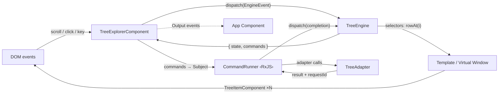
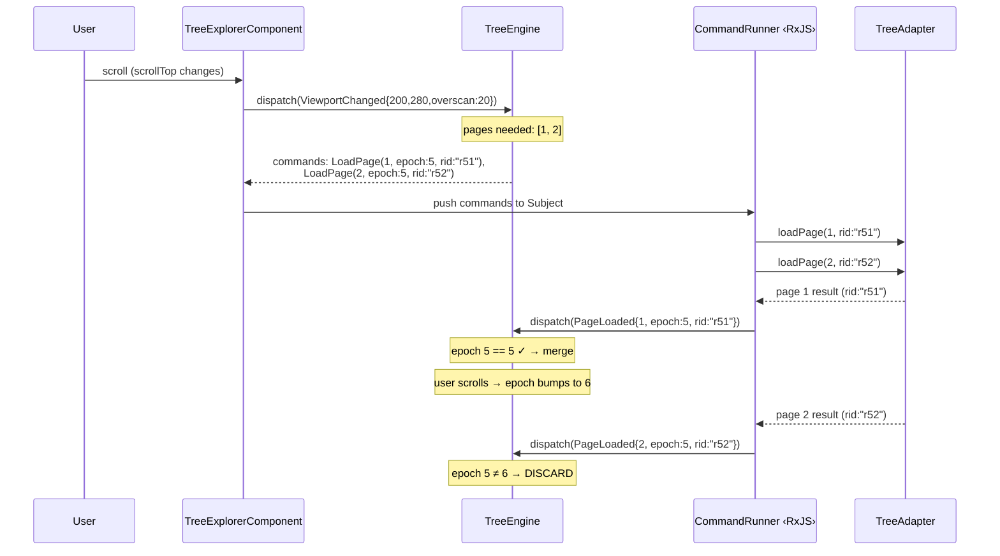
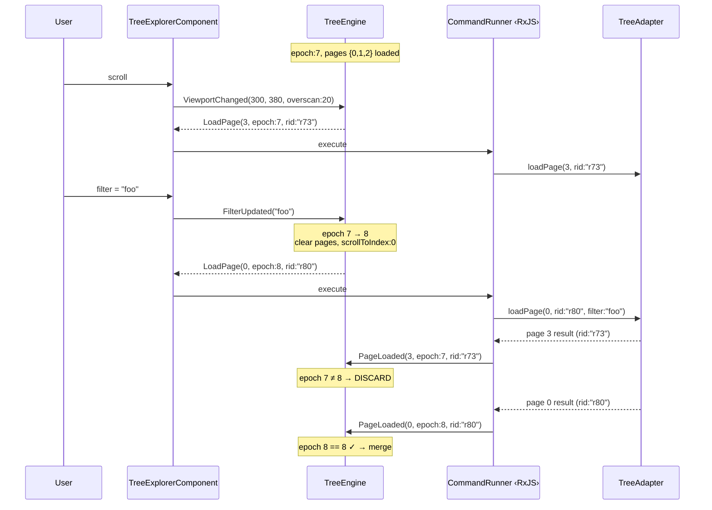
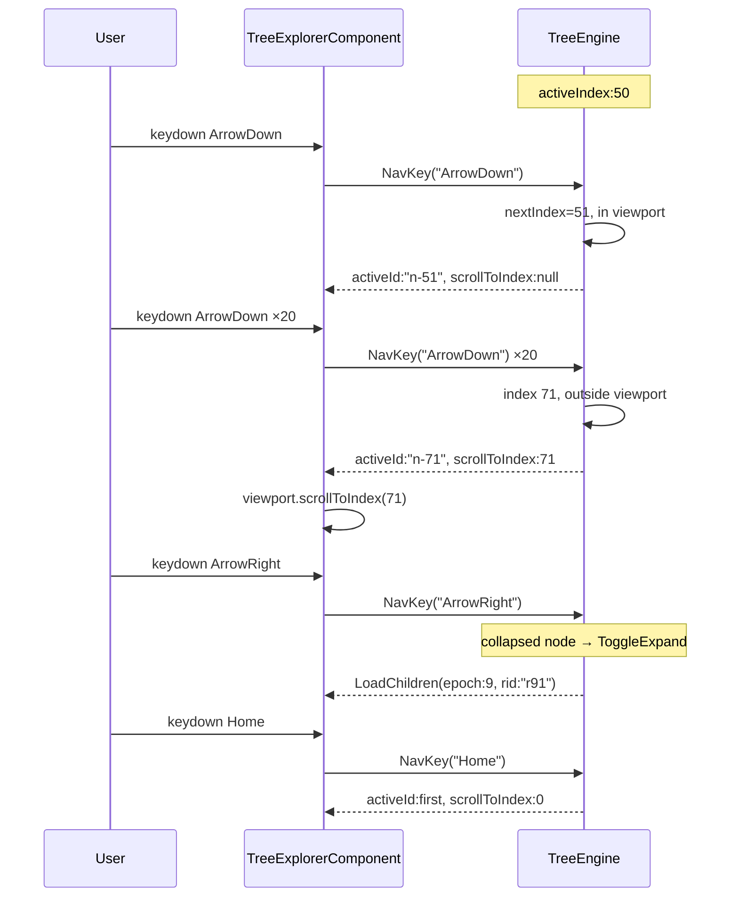
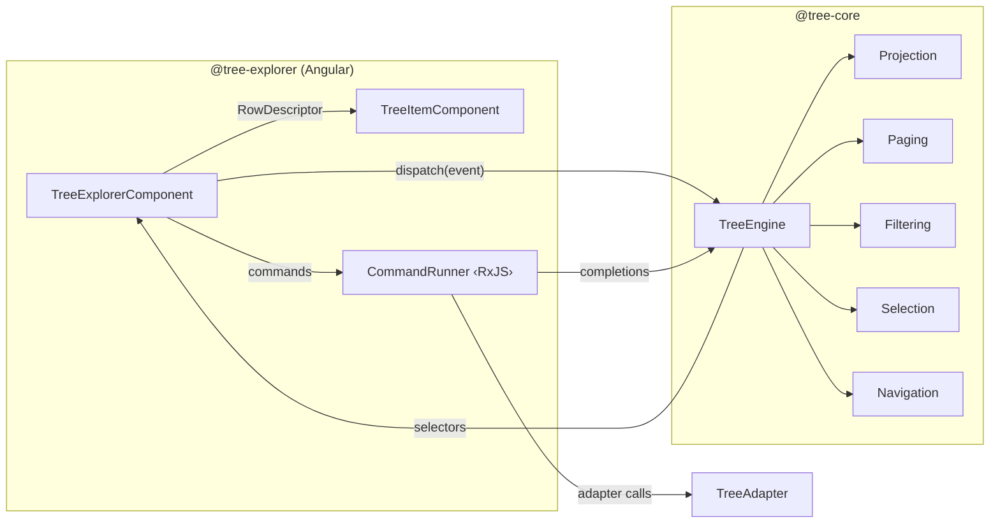

# Diagrams — Angular 20 Tree Explorer + TreeEngine

> **Design rule:** each diagram covers ONE flow, max ~9 nodes, max ~12 edges, short labels.
> Consistent names: `TreeExplorerComponent`, `TreeEngine`, `TreeAdapter`, `TreeItemComponent`, `CommandRunner`.

---

## 1) Architecture Summary (Angular Adaptation)

### What changes (Angular host layer)

- **Host element** replaces Lit `TreeExplorerElement` with Angular `TreeExplorerComponent` (standalone, `OnPush`).
- **Signals** hold the engine snapshot reference and a version counter — drive change detection without `zone.js`.
- **RxJS** powers the `CommandRunner` pipeline (viewport debounce, adapter call orchestration, stale-response filtering, auto-retry).
- Interop is explicit: RxJS `Subject` for intents/viewport → pipeline → write to Signal on completion dispatch.
- **CDK Virtual Scroll** (or a lightweight custom viewport) replaces the manual `position:absolute` spacer from the Lit host.
- **`TreeItemComponent`** is a pure presentational component; receives a `RowDescriptor` via input, emits DOM events upward.
- Angular `Output` emitters (`selectionChange`, `loadError`, etc.) replace Lit `CustomEvent` dispatch.
- **`async-tree` is removed.** `TreeExplorerComponent` is the single entry point.

### What remains identical (engine + modules)

- `@tree-core` package: pure reducer `(state, event) → { state, commands }`, zero framework imports.
- All engine modules unchanged: projection, paging, filtering, selection, navigation, pinned-navigation.
- `TreeAdapter` contract unchanged — adapter is the only domain boundary.
- Epoch + requestId stale-response protection unchanged.
- Command vocabulary unchanged: `LoadPage`, `LoadChildren`, `ScrollTo`, `FocusNode`, etc.
- Selector model unchanged: `totalCount`, `rowAt(i)`, `activeId`, `selectedIds`.
- Config frozen at init. No runtime config mutation.

### Explicitly removed

- `async-tree` / `AsyncTreeComponent` — no export, no alias, no compatibility wrapper.
- `TreeStateService` as a separate Angular injectable is **not used**. The engine instance lives inside `TreeExplorerComponent` directly. Command execution is an RxJS pipeline co-located with the component, not a service.

> **Rationale:** The Lit architecture proved that the element (component) is the natural command-execution boundary. Extracting a service adds indirection without benefit — the component already owns the adapter reference, viewport events, and lifecycle. Keeping everything in one component matches the Lit parity goal and avoids a second stateful object.

---

## 2) Package Layout (Unchanged)

```
packages/
  tree-core/
    src/lib/
      engine/         ← reducer, projection, paging, filtering, selection, navigation
      types/          ← TreeAdapter, TreeConfig, FilterQuery, EngineEvent, EngineCommand, errors
    src/index.ts      ← explicit exports only
    package.json

  tree-explorer/
    src/lib/
      components/
        tree-explorer/  ← TreeExplorerComponent (single entry point)
        tree-item/      ← TreeItemComponent (presentational)
      pipes/            ← optional rendering helpers (highlight-filter, etc.)
    src/index.ts        ← TreeExplorerComponent + TreeItemComponent + re-export core types
    package.json

testing/
  stories/            ← compact Storybook stories + shared harness
  mocks/              ← deterministic fixtures, fake adapters, page-aware fake APIs
```

### Export constraints

| Package | Exports | Does NOT export |
|---|---|---|
| `@tree-core` | `createTreeEngine`, `TreeAdapter`, `TreeConfig`, `DEFAULT_TREE_CONFIG`, `EngineEvent`, `EngineCommand`, `FilterQuery`, `TreeLoadError`, `selectors`, `ProjectedRow`, `RowDescriptor` | Any Angular/Lit/framework type |
| `@tree-explorer` | `TreeExplorerComponent`, `TreeItemComponent`, convenience re-exports of core types | `async-tree`, `AsyncTreeComponent`, internal RxJS subjects, engine instance |

---

## 3) Angular Data Flow Diagrams

### A) End-to-end Angular flow



### B) Scroll / range → page-aware loads (epoch + requestId)



### C) Filter / expand invalidation (epoch bump)



### D) Keyboard navigation (activeId / activeIndex + scrollToIndex)



### E) Module boundary map (Angular host as caller)



---

## 4) Angular Host Responsibilities (TreeExplorerComponent)

### Precise responsibility list

| # | Responsibility | Mechanism |
|---|---|---|
| 1 | **Intent translation** | DOM events (`scroll`, `click`, `keydown`, `contextmenu`) → `EngineEvent` discriminated union variants → `engine.dispatch()` |
| 2 | **Command execution** | `EngineCommand[]` pushed into an RxJS `Subject<EngineCommand>`. Pipeline uses `mergeMap` (bounded concurrency = `maxInFlight`) to call adapter methods. |
| 3 | **Stale response protection** | Adapter results carry `epoch` + `requestId`. Completion event dispatched to engine; engine's reducer guard rejects mismatched epochs. |
| 4 | **Auto-retry** | CommandRunner retries once on adapter failure. Second failure → `dispatch(LoadFailed)`. Retry map keyed by `requestId`. |
| 5 | **Render scheduling** | Engine snapshot written to a `Signal<SelectorOutputs>`. Angular `OnPush` + signals ensures a single CD cycle per batch. `ChangeDetectorRef` not needed. |
| 6 | **Virtual window rendering** | `totalCount` drives spacer height. Visible range computed from scroll position + row height. Template iterates `[startIndex, endIndex)` calling `rowAt(i)`. |
| 7 | **Context menu ownership** | `TreeExplorerComponent` handles `contextmenu` DOM event, positions the menu, dispatches `ContextMenuOpen` to engine, renders menu items from config-provided actions. |
| 8 | **No adapter calls from TreeItemComponent** | `TreeItemComponent` is presentation-only. It receives `RowDescriptor` as input, emits expand-toggle / row-click events that bubble to `TreeExplorerComponent`. |
| 9 | **Output event emission** | Angular `output()` emitters for `selectionChange`, `loadError`, `navigationResult`. Triggered by engine commands (`EMIT_SELECTION_CHANGE`, `EMIT_LOAD_ERROR`, etc.). |

### Forbidden in TreeExplorerComponent

- Domain logic or API branching.
- Direct node mutation bypassing `engine.dispatch()`.
- Maintaining a `visibleRows: RowDescriptor[]` cache array.
- Async calls in template expressions.
- Adapter calls from `TreeItemComponent`.

---

## 5) Angular Implementation Sketch

### 5.1) Updated union types (EngineEvent / EngineCommand)

```ts
// @tree-core — events (discriminated union, unchanged from framework-agnostic)

// ── Intent events ──
export type EngineEvent =
  | { type: 'Init'; config: TreeConfig }
  | { type: 'Destroy' }
  | { type: 'ViewportChanged'; start: number; end: number; overscan: number }
  | { type: 'ToggleExpand'; nodeId: string }
  | { type: 'FilterUpdated'; query: string }
  | { type: 'NavKey'; key: NavKeyName; shift: boolean; ctrl: boolean }
  | { type: 'SelectIntent'; nodeId: string; mode: SelectMode }
  | { type: 'ContextMenuOpen'; nodeId: string | null }
  | { type: 'RefreshAll' }
  | { type: 'RefreshNode'; nodeId: string }
  // ── Async completion events ──
  | { type: 'PageLoaded'; pageKey: number; epoch: number; requestId: string; data: unknown[]; totalCount: number }
  | { type: 'ChildrenLoaded'; nodeId: string; epoch: number; requestId: string; data: unknown[] }
  | { type: 'LoadFailed'; requestId: string; epoch: number; error: LoadError };

export type NavKeyName =
  | 'ArrowDown' | 'ArrowUp' | 'ArrowRight' | 'ArrowLeft'
  | 'Home' | 'End' | 'Enter' | 'Space'
  | 'PageDown' | 'PageUp';

export type SelectMode = 'set' | 'toggle' | 'range';

// ── Commands (side-effects for host) ──
export type EngineCommand =
  | { type: 'LoadRoots'; epoch: number; requestId: string }
  | { type: 'LoadPage'; pageKey: number; epoch: number; requestId: string; filter?: string }
  | { type: 'LoadChildren'; nodeId: string; epoch: number; requestId: string }
  | { type: 'ScrollTo'; index: number }
  | { type: 'FocusNode'; nodeId: string }
  | { type: 'EmitSelectionChange'; selectedIds: string[] }
  | { type: 'EmitLoadError'; error: LoadError }
  | { type: 'EmitNavigationResult'; result: NavigationResult };

// ── Output types ──
export interface SelectorOutputs {
  readonly totalCount: number;
  rowAt(i: number): RowDescriptor | null;
  rowKeyAt(i: number): string;
  readonly activeId: string | null;
  readonly selectedIds: ReadonlySet<string>;
  readonly scrollToIndex: number | null;
  readonly contextTargetId: string | null;
}

export interface RowDescriptor {
  readonly id: string;
  readonly label: string;
  readonly icon: string | null;
  readonly depth: number;
  readonly expanded: boolean;
  readonly expandable: boolean;
  readonly selected: boolean;
  readonly active: boolean;
  readonly status: 'loaded' | 'loading' | 'error';
}

export interface LoadError {
  readonly scope: 'root' | 'children' | 'page' | 'navigation';
  readonly nodeId?: string;
  readonly pageKey?: number;
  readonly reason: string;
}
```

### 5.2) TreeExplorerComponent skeleton

```ts
import {
  Component, ChangeDetectionStrategy, OnInit, OnDestroy,
  input, output, signal, computed, ElementRef, NgZone, inject,
} from '@angular/core';
import { Subject, mergeMap, takeUntil, filter, retry, EMPTY } from 'rxjs';
import {
  createTreeEngine, TreeAdapter, TreeConfig, EngineCommand,
  EngineEvent, SelectorOutputs, RowDescriptor,
} from '@anthropic-ai/tree-core';

@Component({
  selector: 'td-tree-explorer',
  standalone: true,
  changeDetection: ChangeDetectionStrategy.OnPush,
  imports: [TreeItemComponent],
  template: `
    <div class="tree-viewport"
         (scroll)="onScroll($event)"
         (keydown)="onKeydown($event)"
         role="tree"
         [attr.aria-activedescendant]="snap().activeId"
         tabindex="0">

      <!-- Total-height spacer for virtual scroll -->
      <div class="tree-spacer"
           [style.height.px]="snap().totalCount * config().virtualization.itemSize">

        @for (row of visibleRows(); track row.id) {
          <td-tree-item
            [row]="row"
            [itemSize]="config().virtualization.itemSize"
            [style.top.px]="row._top"
            (expandToggle)="dispatch({ type: 'ToggleExpand', nodeId: row.id })"
            (rowClick)="dispatch({ type: 'SelectIntent', nodeId: row.id, mode: 'set' })"
          />
        }
      </div>
    </div>
  `,
})
export class TreeExplorerComponent implements OnInit, OnDestroy {
  // ── Inputs (from consuming app) ──
  readonly adapter = input.required<TreeAdapter>();
  readonly config  = input.required<TreeConfig>();

  // ── Outputs (to consuming app) ──
  readonly selectionChange   = output<string[]>();
  readonly loadError         = output<LoadError>();
  readonly navigationResult  = output<NavigationResult>();

  // ── Engine + signal state ──
  private engine!: ReturnType<typeof createTreeEngine>;
  protected snap = signal<SelectorOutputs>(EMPTY_SNAPSHOT);
  private version = signal(0);

  // ── RxJS plumbing ──
  private command$  = new Subject<EngineCommand>();
  private destroy$  = new Subject<void>();

  private el      = inject(ElementRef);
  private ngZone  = inject(NgZone);

  // ── Derived: visible rows for the current scroll window ──
  protected visibleRows = computed<(RowDescriptor & { _top: number })[]>(() => {
    const s = this.snap();
    const v = this.version(); // subscribe to version bumps
    const itemSize = this.config().virtualization.itemSize;
    const viewport = this.el.nativeElement.querySelector('.tree-viewport');
    if (!viewport || !s) return [];

    const scrollTop  = viewport.scrollTop;
    const viewH      = viewport.clientHeight;
    const overscan   = this.config().virtualization.overscan ?? 5;
    const start      = Math.max(0, Math.floor(scrollTop / itemSize) - overscan);
    const end        = Math.min(s.totalCount, Math.ceil((scrollTop + viewH) / itemSize) + overscan);

    const rows: (RowDescriptor & { _top: number })[] = [];
    for (let i = start; i < end; i++) {
      const r = s.rowAt(i);
      if (r) rows.push({ ...r, _top: i * itemSize });
    }
    return rows;
  });

  // ── Lifecycle ──
  ngOnInit(): void {
    this.engine = createTreeEngine(this.config());

    // Subscribe to engine state changes → update signal
    this.engine.subscribe(() => {
      this.snap.set(this.engine.getSnapshot());
      this.version.update(v => v + 1);
    });

    // Init: always emits LoadRoots
    this.runCommands(this.engine.dispatch({ type: 'Init', config: this.config() }));
    this.snap.set(this.engine.getSnapshot());

    // Command runner pipeline (RxJS)
    this.command$.pipe(
      mergeMap(cmd => this.executeCommand(cmd), this.config().maxInFlight ?? 3),
      takeUntil(this.destroy$),
    ).subscribe();
  }

  ngOnDestroy(): void {
    this.engine.dispatch({ type: 'Destroy' });
    this.destroy$.next();
    this.destroy$.complete();
  }

  // ── Intent dispatch (DOM → engine) ──
  dispatch(event: EngineEvent): void {
    const cmds = this.engine.dispatch(event);
    this.emitOutputEvents(event);
    this.runCommands(cmds);
  }

  // ── Push commands into RxJS pipeline ──
  private runCommands(cmds: EngineCommand[]): void {
    for (const cmd of cmds) {
      // Synchronous commands handled immediately
      if (cmd.type === 'ScrollTo') {
        const vp = this.el.nativeElement.querySelector('.tree-viewport');
        if (vp) vp.scrollTop = cmd.index * this.config().virtualization.itemSize;
        continue;
      }
      if (cmd.type === 'FocusNode') {
        this.el.nativeElement.querySelector(`#${CSS.escape(cmd.nodeId)}`)?.focus();
        continue;
      }
      if (cmd.type === 'EmitSelectionChange') {
        this.selectionChange.emit(cmd.selectedIds);
        continue;
      }
      if (cmd.type === 'EmitLoadError') {
        this.loadError.emit(cmd.error);
        continue;
      }
      if (cmd.type === 'EmitNavigationResult') {
        this.navigationResult.emit(cmd.result);
        continue;
      }
      // Async commands → RxJS pipeline
      this.command$.next(cmd);
    }
  }

  // ── Command runner (adapter calls + auto-retry) ──
  private retryMap = new Map<string, number>();

  private executeCommand(cmd: EngineCommand): Observable<void> {
    return new Observable<void>(subscriber => {
      const run = async () => {
        try {
          switch (cmd.type) {
            case 'LoadRoots': {
              const roots = await this.adapter().getRoots();
              this.dispatch({
                type: 'ChildrenLoaded', nodeId: '__root__',
                epoch: cmd.epoch, requestId: cmd.requestId, data: roots,
              });
              break;
            }
            case 'LoadPage': {
              const result = await this.adapter().loadPage!(cmd.pageKey, cmd.filter);
              this.dispatch({
                type: 'PageLoaded', pageKey: cmd.pageKey,
                epoch: cmd.epoch, requestId: cmd.requestId,
                data: result.items, totalCount: result.totalCount,
              });
              break;
            }
            case 'LoadChildren': {
              const children = await this.adapter().getChildren(cmd.nodeId);
              this.dispatch({
                type: 'ChildrenLoaded', nodeId: cmd.nodeId,
                epoch: cmd.epoch, requestId: cmd.requestId, data: children,
              });
              break;
            }
          }
          subscriber.next();
          subscriber.complete();
        } catch (e) {
          this.handleLoadError(cmd as any, String(e));
          subscriber.next();
          subscriber.complete();
        }
      };
      run();
    });
  }

  private handleLoadError(
    cmd: EngineCommand & { epoch: number; requestId: string },
    reason: string,
  ): void {
    const attempts = (this.retryMap.get(cmd.requestId) ?? 0) + 1;
    this.retryMap.set(cmd.requestId, attempts);
    if (attempts < 2) {
      this.command$.next(cmd); // retry once
    } else {
      this.retryMap.delete(cmd.requestId);
      this.dispatch({
        type: 'LoadFailed', requestId: cmd.requestId,
        epoch: cmd.epoch, error: { scope: 'page', reason },
      });
    }
  }

  // ── Viewport scroll → engine ──
  onScroll(e: Event): void {
    const el = e.target as HTMLElement;
    const itemSize = this.config().virtualization.itemSize;
    const start = Math.floor(el.scrollTop / itemSize);
    const end = start + Math.ceil(el.clientHeight / itemSize);
    this.dispatch({
      type: 'ViewportChanged',
      start, end, overscan: this.config().virtualization.overscan ?? 5,
    });
  }

  // ── Keyboard → engine ──
  onKeydown(e: KeyboardEvent): void {
    if (!this.config().keyboard.enabled) return;
    const navKeys = ['ArrowDown','ArrowUp','ArrowRight','ArrowLeft','Home','End','Enter',' ','PageDown','PageUp'];
    if (!navKeys.includes(e.key)) return;
    this.dispatch({
      type: 'NavKey',
      key: e.key === ' ' ? 'Space' : e.key as any,
      shift: e.shiftKey,
      ctrl: e.ctrlKey || e.metaKey,
    });
    e.preventDefault();
  }

  // ── Filter (debounced) ──
  private filterTimer?: ReturnType<typeof setTimeout>;
  updateFilter(query: string): void {
    clearTimeout(this.filterTimer);
    this.filterTimer = setTimeout(() => {
      this.dispatch({ type: 'FilterUpdated', query });
    }, this.config().filtering.debounceMs ?? 200);
  }

  // ── Public API ──
  refresh(): void { this.dispatch({ type: 'RefreshAll' }); }
  refreshNode(nodeId: string): void { this.dispatch({ type: 'RefreshNode', nodeId }); }

  // ── Output event mapping ──
  private emitOutputEvents(event: EngineEvent): void {
    // Additional output mapping if needed (e.g., contextmenu events)
  }
}

const EMPTY_SNAPSHOT: SelectorOutputs = {
  totalCount: 0, rowAt: () => null, rowKeyAt: () => '',
  activeId: null, selectedIds: new Set(), scrollToIndex: null, contextTargetId: null,
};
```

### 5.3) TreeItemComponent (presentational only)

```ts
import { Component, ChangeDetectionStrategy, input, output } from '@angular/core';
import type { RowDescriptor } from '@anthropic-ai/tree-core';

@Component({
  selector: 'td-tree-item',
  standalone: true,
  changeDetection: ChangeDetectionStrategy.OnPush,
  template: `
    <div class="tree-row"
         [class.selected]="row().selected"
         [class.active]="row().active"
         [class.loading]="row().status === 'loading'"
         [class.error]="row().status === 'error'"
         [style.padding-left.px]="row().depth * 20"
         [attr.id]="row().id"
         [attr.role]="'treeitem'"
         [attr.aria-expanded]="row().expandable ? row().expanded : null"
         [attr.aria-selected]="row().selected"
         [attr.aria-level]="row().depth + 1"
         (click)="rowClick.emit()"
         (dblclick)="row().expandable && expandToggle.emit()">

      @if (row().expandable) {
        <button class="expand-toggle"
                (click)="$event.stopPropagation(); expandToggle.emit()"
                [attr.aria-label]="row().expanded ? 'Collapse' : 'Expand'">
          <span class="chevron" [class.expanded]="row().expanded"></span>
        </button>
      }

      @if (row().icon) {
        <span class="icon">{{ row().icon }}</span>
      }

      @if (row().status === 'loading') {
        <span class="skeleton-label"></span>
      } @else if (row().status === 'error') {
        <span class="error-label">Failed to load</span>
      } @else {
        <span class="label">{{ row().label }}</span>
      }
    </div>
  `,
})
export class TreeItemComponent {
  // ── Inputs ──
  readonly row      = input.required<RowDescriptor>();
  readonly itemSize = input<number>(36);

  // ── Output events (bubble to TreeExplorerComponent) ──
  readonly expandToggle = output<void>();
  readonly rowClick     = output<void>();

  // NO adapter calls. NO engine dispatch. NO state.
}
```

### 5.4) Angular usage examples

#### App A — selection ON, context menu ON, page-aware OFF

```ts
// app-a/tree.adapter.ts
import type { TreeAdapter } from '@anthropic-ai/tree-core';

interface OrgNode {
  id: string;
  name: string;
  icon: string;
  hasChildren: boolean;
}

export const orgAdapter: TreeAdapter<OrgNode> = {
  getId:          (n) => n.id,
  getLabel:       (n) => n.name,
  getIcon:        (n) => n.icon,
  isExpandable:   (n) => n.hasChildren,
  getRoots:       ()  => fetch('/api/org/roots').then(r => r.json()),
  getChildren:    (id) => fetch(`/api/org/${id}/children`).then(r => r.json()),
  filterMatch:    (n, q) => n.name.toLowerCase().includes(q.toLowerCase()),
};
```

```ts
// app-a/tree.config.ts
import type { TreeConfig } from '@anthropic-ai/tree-core';

export const orgConfig: TreeConfig = {
  virtualization: { enabled: true, itemSize: 32, mode: 'auto', autoThreshold: 100, overscan: 10 },
  pageAware:      { enabled: false, defaultPageSize: 100 },
  selection:      { mode: 'multi', showCheckboxes: false },
  filtering:      { mode: 'client', showParentsOfMatches: true, autoExpandMatches: true, debounceMs: 300 },
  contextMenu:    { enabled: true },
  pinned:         { enabled: false, label: 'Pinned' },
  keyboard:       { enabled: true, typeahead: false, typeaheadTimeout: 500 },
  accessibility:  { focusMode: 'activedescendant', role: 'tree' },
};
```

```html
<!-- app-a/tree-page.component.html -->
<td-tree-explorer
  [adapter]="orgAdapter"
  [config]="orgConfig"
  (selectionChange)="onSelect($event)"
  (loadError)="onError($event)"
/>
```

```ts
// app-a/tree-page.component.ts
import { Component } from '@angular/core';
import { TreeExplorerComponent } from '@anthropic-ai/tree-explorer';
import { orgAdapter } from './tree.adapter';
import { orgConfig } from './tree.config';

@Component({
  selector: 'app-tree-page',
  standalone: true,
  imports: [TreeExplorerComponent],
  templateUrl: './tree-page.component.html',
})
export class TreePageComponent {
  readonly orgAdapter = orgAdapter;
  readonly orgConfig  = orgConfig;

  onSelect(ids: string[]) { console.log('selected:', ids); }
  onError(err: any)       { console.error('tree error:', err); }
}
```

#### App B — selection OFF, pinned ON, page-aware ON

```ts
// app-b/tree.adapter.ts
import type { TreeAdapter, PageResult } from '@anthropic-ai/tree-core';

interface AssetNode {
  assetId: string;
  title: string;
  childCount: number;
}

export const assetAdapter: TreeAdapter<AssetNode> = {
  getId:        (n) => n.assetId,
  getLabel:     (n) => n.title,
  isExpandable: (n) => n.childCount > 0,
  getRoots:     ()  => fetch('/api/assets/roots').then(r => r.json()),
  getChildren:  (id) => fetch(`/api/assets/${id}/children`).then(r => r.json()),
  loadPage:     (pk, f) => fetch(`/api/assets/page/${pk}?q=${f ?? ''}`)
                            .then(r => r.json()) as Promise<PageResult<AssetNode>>,
  filterMatch:  (n, q) => n.title.toLowerCase().includes(q.toLowerCase()),
  resolvePath:  (id) => fetch(`/api/assets/${id}/path`).then(r => r.json()),
};
```

```ts
// app-b/tree.config.ts
import type { TreeConfig } from '@anthropic-ai/tree-core';

export const assetConfig: TreeConfig = {
  virtualization: { enabled: true, itemSize: 28, mode: 'always', autoThreshold: 50, overscan: 20 },
  pageAware:      { enabled: true, defaultPageSize: 200 },
  selection:      { mode: 'none', showCheckboxes: false },
  filtering:      { mode: 'client', showParentsOfMatches: true, autoExpandMatches: true, debounceMs: 300 },
  contextMenu:    { enabled: false },
  pinned:         { enabled: true, label: 'Pinned' },
  keyboard:       { enabled: true, typeahead: false, typeaheadTimeout: 500 },
  accessibility:  { focusMode: 'activedescendant', role: 'tree' },
};
```

```html
<!-- app-b/tree-page.component.html -->
<td-tree-explorer
  [adapter]="assetAdapter"
  [config]="assetConfig"
  (navigationResult)="onNav($event)"
  (loadError)="onError($event)"
/>
<button (click)="treeRef.refresh()">Refresh All</button>
```

```ts
// app-b/tree-page.component.ts
import { Component, ViewChild } from '@angular/core';
import { TreeExplorerComponent } from '@anthropic-ai/tree-explorer';
import { assetAdapter } from './tree.adapter';
import { assetConfig } from './tree.config';

@Component({
  selector: 'app-asset-tree',
  standalone: true,
  imports: [TreeExplorerComponent],
  templateUrl: './tree-page.component.html',
})
export class AssetTreeComponent {
  @ViewChild(TreeExplorerComponent) treeRef!: TreeExplorerComponent;

  readonly assetAdapter = assetAdapter;
  readonly assetConfig  = assetConfig;

  onNav(result: any)  { console.log('navigation:', result); }
  onError(err: any)   { console.error('tree error:', err); }
}
```

> **Cross-app pattern:** each app provides only `adapter` + `config`. No engine wiring, no subclassing, no service injection. Each `<td-tree-explorer>` gets its own engine + adapter — safe for multi-instance pages.

---

## 6) Decision Log Updates (Angular-Specific)

Only entries where Angular changes tradeoffs or implementation velocity relative to the Lit baseline.

| # | Decision | Angular Delta | Rationale |
|---|---|---|---|
| D-NG1 | **Signals for snapshot, RxJS for command pipeline** | Lit used `@state()` + raw Promises; Angular uses `signal()` + `Subject` + `mergeMap` | Signals eliminate manual CD calls. RxJS gives bounded concurrency (`mergeMap` with `maxInFlight`) and natural `takeUntil` cleanup. No spaghetti: Subjects are write-only for intents, Signals are read-only for rendering. |
| D-NG2 | **No separate `TreeStateService`** | Lit element co-located engine + command runner; Angular mirrors this in the component | Adding a service would duplicate the Lit→Angular mapping without reducing complexity. Engine is the single store; the component is the command executor. If a future app needs shared state across components, a service can wrap the component — but that's a consumer concern, not library architecture. |
| D-NG3 | **`OnPush` + standalone** | Not applicable to Lit | Standard Angular 20 pattern. Signals make `OnPush` trivially correct. Standalone removes NgModule overhead. |
| D-NG4 | **Context menu remains component-owned** | Identical to Lit (element-owned) | Angular overlay (CDK Overlay or manual) is the component's responsibility. Engine only tracks `contextTargetId`. |
| D-NG5 | **Config frozen at init — same as Lit** | No change | `Object.freeze(config)` in engine. To change config: destroy + recreate component. |
| D-NG6 | **Fixed row height — same as Lit** | No change | Variable row height is expensive and optional. If needed, label it as a separate "advanced" mode with resize-observer overhead. Not in v1. |
| D-NG7 | **Adapter calls remain command-based** | Could have been synchronous service calls; kept as commands | Commands remain inspectable data. Testing: assert "engine emitted LoadPage for page 3" without executing the actual adapter. |
| D-NG8 | **`async-tree` removed** | Same as Lit plan | `TreeExplorerComponent` is the single entry point. No compatibility alias exported. |
| D-NG9 | **Angular 20 host glue clarified** | Legacy docs referenced wrapper services; Angular 20 baseline keeps engine + command runner co-located in `TreeExplorerComponent` | Prevents dual state ownership and keeps parity with Lit host model while still using RxJS for bounded async command execution. |

### What stays synchronous vs command-based

| Operation | Sync or Command | Why |
|---|---|---|
| Expand/collapse toggle | **Sync** (engine dispatch returns new state + possible LoadChildren command) | State transition is pure. Load is a command. |
| Selection | **Sync** (engine dispatch) + **Command** `EmitSelectionChange` | State is sync; output emission is a command. |
| Keyboard navigation | **Sync** (engine dispatch) + optional **Command** `ScrollTo` | Focus change is sync; scroll is a DOM side-effect command. |
| Filter update | **Sync** (engine dispatch) + **Commands** `LoadPage[]` | Epoch bump is sync; fresh page loads are commands. |
| Page/children load | **Command** (async adapter call) | Always async; always command-based. |
| Scroll viewport sync | **Sync** (engine dispatch) + **Commands** `LoadPage[]` | Range computation is sync; loads are commands. |

---

## 7) Testing and Performance Gates (Angular)

### 7.1) Engine unit tests (pure — no Angular)

| Test category | What | Framework |
|---|---|---|
| Projection | Init → flat list matches. Expand/collapse → correct ordering + depth. | Vitest / Jest (no DOM) |
| Paging | Viewport range → correct page commands. Dedup inflight. Stale rejection. | Vitest / Jest |
| Filtering | Client match → matchedIds + ancestors. Clear filter → restore. New nodes refiltered. | Vitest / Jest |
| Selection | Single/toggle/range modes. `'none'` → no-op. Anchor preservation. | Vitest / Jest |
| Navigation | Arrow keys move focus. ArrowRight expands. ArrowLeft collapses. Home/End bounds. | Vitest / Jest |
| Determinism | Same event stream → identical snapshots + commands (property-based). | Vitest / Jest |
| Invariants | `assertInvariants()` after every dispatch (dev mode). | Vitest / Jest |

### 7.2) Component integration tests (Angular TestBed)

| Test | What | Tooling |
|---|---|---|
| Render from adapter | Provide adapter + config → component renders root rows | `TestBed` + `ComponentFixture` |
| Expand/collapse | Click chevron → children appear / disappear | `TestBed` + `fixture.detectChanges()` |
| Virtual scroll | 10k rows → only ~60 DOM elements present | `TestBed` + DOM query count |
| Page loads on scroll | Scroll viewport → adapter `loadPage` called for visible pages | `TestBed` + spy on adapter |
| Selection output | Click row → `selectionChange` emits correct IDs | `TestBed` + `output` spy |
| Context menu | Right-click → menu appears, positioned correctly | `TestBed` + DOM assertion |
| Keyboard nav | `ArrowDown` × 5 → `activeId` moves, `aria-activedescendant` updates | `TestBed` + `dispatchEvent` |

### 7.3) Race-condition tests (stale completions)

| Test | Scenario | Assert |
|---|---|---|
| Scroll then filter | Scroll triggers LoadPage(epoch:5) → filter changes (epoch:6) → page 5 result arrives | Engine discards result (epoch mismatch). Projection reflects filter, not stale page. |
| Expand → collapse → expand B | Expand A (epoch:4) → collapse A (epoch:5) → expand B (epoch:6) → A result arrives | A result discarded. B result merged. |
| Rapid scroll | 10 ViewportChanged events in 16ms | No duplicate LoadPage for same pageKey. `mergeMap` concurrency honored. |
| Double filter | Filter "fo" → filter "foo" (within debounce) | Only one `FilterUpdated("foo")` reaches engine. |

### 7.4) Performance gates (CI-enforced)

| Gate | Metric | Target | Fail threshold |
|---|---|---|---|
| Reducer latency | `dispatch()` wall time | ≤ 2 ms | > 5 ms |
| `rowAt(i)` lookup | Selector call @ 500K rows | ≤ 5 ms | > 10 ms |
| Scroll FPS | Frame rate during continuous scroll | 60 fps | < 40 fps warns, < 30 fps fails |
| DOM row count | Max DOM elements during scroll | ≤ 120 (viewport + overscan) | > 200 |
| Memory ceiling | Heap snapshot @ 500K nodes | < 200 MB | > 200 MB |
| GC pressure | Allocations per dispatch | bounded (no array explosion) | benchmark regression > 10% |
| Init to first render | Time from `ngOnInit` to first visible row | < 100 ms (local data) | > 300 ms |

### 7.5) Accessibility gates

| Gate | Tool | Frequency |
|---|---|---|
| axe-core audit | `@axe-core/playwright` or `jest-axe` | Every CI run |
| ARIA attribute check | Unit: `role=tree`, `aria-expanded`, `aria-level`, `aria-activedescendant` | Every CI run |
| Keyboard traversal | Integration: Home → End → ArrowDown ×N → verify `activeId` sequence | Every CI run |
| Screen reader labels | `aria-label` on expand toggle, error rows | Every CI run |
