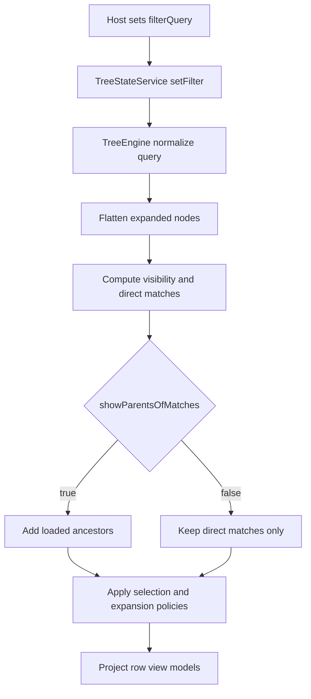

# Filtering

> Don’t paste this into your app. Read it, adapt it, and decide what you’re actually building.

## 1) Getting started

1. Bind wrapper input `filterQuery` to your search state.
2. Pick a filtering mode:
   - `client`, `hybrid`, or `server`.
3. Add adapter matching strategy:
   - `matches(data, query)` or `getSearchText(data)`.
4. Render highlight ranges using `TreeHighlightMatchPipe` where needed.
5. Validate with Storybook:
   - `Tree/Filtering (100+ elements)`
   - `Tree/Errors & edge cases`

```html
<tree-explorer
  [data]="data"
  [adapter]="adapter"
  [config]="config"
  [filterQuery]="query()" />
```

## 2) Purpose

- Keep filtering state and policies in `TreeEngine`.
- Keep domain semantics in adapters.
- Keep wrappers deterministic and virtualization-safe.

## 3) Feature overview



Behavior rules:

- `adapter.isVisible` remains baseline visibility gating.
- Query matching is adapter-first when `adapter.matches` exists.
- `autoExpandMatches` is optional and loaded-graph only.
- `selectionPolicy='clearHidden'` removes filtered-out selections.
- In `server` mode, query matching/highlight generation is skipped in core.

## 4) API overview

| API | Signature | Meaning | Notes |
|---|---|---|---|
| `setFilter` | `(filterInput, adapter?) => boolean` | Applies normalized query | Returns false when no state change |
| `clearFilter` | `() => boolean` | Clears active query | Returns false when already clear |
| `reapplyFilter` | `(adapter) => boolean` | Re-runs policies for active query | Use after state-changing loads |
| `getFilteredFlatList` | `(adapter, config?) => TreeRowViewModel[]` | Returns visible projected rows | Primary wrapper read API |
| `selectRange` | `(fromId, toId, adapter?, config?)` | Range-select by filtered order when adapter passed | Falls back to structural range without adapter |

Filtering config:

| Field | Type | Default | Meaning | Notes |
|---|---|---|---|---|
| `mode` | `'client' \\| 'hybrid' \\| 'server'` | `'client'` | Query execution policy | `server` assumes backend pre-filtering |
| `showParentsOfMatches` | `boolean` | `true` | Keep loaded ancestor context visible | Tree-search ergonomics |
| `autoExpandMatches` | `boolean` | `false` | Expand loaded ancestors of matches | Opt-in because it mutates expansion state |
| `selectionPolicy` | `'keep' \\| 'clearHidden'` | `'keep'` | Hidden-selection behavior under query | Use `clearHidden` for strict visible selection |
| `keepPlaceholdersVisible` | `boolean` | `true` | Placeholder visibility under filter | Preserves paged geometry |

## 5) Edge cases & failure modes

- Query only matches unloaded descendants:
  - no result until branch loads (expected).
- `server` mode + client query text:
  - rows are not client-filtered; backend response shape wins.
- Adapter visibility gate + query:
  - `isVisible=false` rows remain hidden regardless of query match.
- Rapid query updates:
  - wrapper-level debounce is still recommended for high-frequency typing.

## 6) Recipes

- Domain-specific query semantics:
  - implement `adapter.matches`.
- Lightweight default search:
  - implement `adapter.getSearchText`.
- Filtered range-select correctness:
  - call `selectRange` with adapter+config.
- Clear hidden selections for strict UX:
  - set `selectionPolicy='clearHidden'`.
- Storybook references:
  - `packages/tree-explorer/src/stories/tree-explorer.filtering-cookbook.stories.ts`
  - `packages/tree-explorer/src/stories/tree-explorer.errors-edge-cases.stories.ts`

## 7) Non-goals / pitfalls

- Do not duplicate filter logic in wrapper and adapter.
- Do not run row-level template filtering.
- Do not assume unloaded descendants can match without loading strategy.
- Do not attach heavy per-keystroke object allocations in row render paths.
