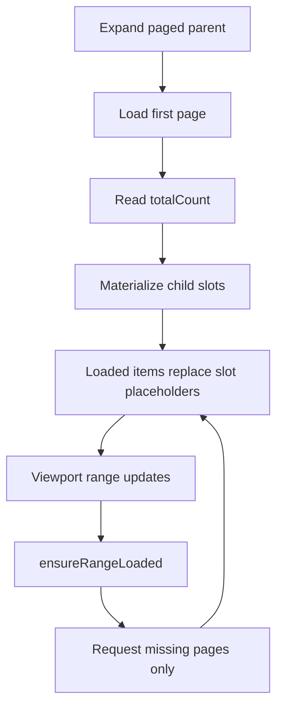

# Page-Aware Virtual Scroll

> Don’t paste this into your app. Read it, adapt it, and decide what you’re actually building.

## 1) Getting started

1. Enable pagination per parent in the adapter:
   - `getPagination(node) -> { enabled: true, pageSize }`
2. Make `loadChildren` accept a `PageRequest`.
3. Return `PageResult<TSource>` with `totalCount`.
4. Use `TreeExplorerComponent` with virtual scroll enabled.
5. Validate with Storybook:
   - `Tree/Page-aware virtual scroll (X-Total-Count)`
   - `Tree/Cookbook/Errors & edge cases`

```ts
const adapter: TreeAdapter<Node> = {
  getId: (s) => s.id,
  getLabel: (d) => d.name,
  hasChildren: (d) => !!d.hasChildren,
  getPagination: (node) => node.id === 'catalog'
    ? { enabled: true, pageSize: 50, pageIndexing: 'zero-based' }
    : undefined,
  loadChildren: (node, reqOrSource) => api.loadPage(node.id, reqOrSource as PageRequest),
};
```

## 2) Purpose

- Keep virtual-scroll geometry stable while data is paged.
- Avoid full prefetch for very large branches.
- Request only pages that intersect rendered placeholder ranges.

## 3) Feature overview



Behavior rules:

- Placeholder IDs are deterministic: `__tree_placeholder__<parentId>__<index>`.
- In-flight dedupe is by `(parentId, pageIndex)`.
- Page errors are tracked per page; retries can target only failed pages.
- Page patching updates affected ranges; full-slot materialization occurs only when total-count shape changes.

## 4) API overview

| Field / API | Type | Default | Meaning | Notes |
|---|---|---|---|---|
| `TreePaginationConfig.enabled` | `boolean` | required | Enables per-parent paging | Set per node in adapter |
| `TreePaginationConfig.pageSize` | `number` | required | Page size for parent | Stable sizes are recommended |
| `TreePaginationConfig.pageIndexing` | `'zero-based' \\| 'one-based'` | `'zero-based'` | Adapter/API index mode | Engine internal indexing stays zero-based |
| `TreePaginationConfig.initialTotalCount` | `number` | `undefined` | Optional slot priming count before first page success | Useful for initial-page failure placeholders |
| `PageRequest` | `{ pageIndex, pageSize }` | n/a | Requested page | Wrapper converts to adapter indexing when needed |
| `PageResult<T>` | `{ items, totalCount }` | n/a | Page payload and branch size | `totalCount` drives placeholder slot count |

Key engine/service calls:

- `TreeEngine.ensureRangeLoaded(parentId, {start,end})`
- `TreeEngine.applyPagedChildren(parentId, request, children, totalCount)`
- `TreeStateService.ensureRangeLoaded(start,end)`

## 5) Edge cases & failure modes

- Initial page fails:
  - parent remains stable; error state emitted; retry is explicit.
- Later page fails:
  - failed page placeholders remain; only that page retries.
- Unknown `totalCount` before first success:
  - slot geometry is finalized after first successful page payload.
- One-based backend:
  - wrapper converts request page index before adapter call.
- Sparse final page:
  - final slot range is partial; no fake data rows are created.

## 6) Recipes

- If your API returns count in headers:
  - map header to `PageResult.totalCount`.
- If you need deterministic retries:
  - keep error pages in debug UI and trigger range reload or targeted retry.
- If your backend uses one-based pages:
  - set `pageIndexing: 'one-based'`.
- Storybook references:
  - `packages/tree-explorer/src/stories/tree-explorer.page-aware.stories.ts`
  - `packages/tree-explorer/src/stories/tree-explorer.page-aware-nested.stories.ts`
  - `packages/tree-explorer/src/stories/tree-explorer.errors-edge-cases.stories.ts`

## 7) Non-goals / pitfalls

- Do not fetch all pages on expand.
- Do not generate random placeholder IDs.
- Do not run filtering in row components to hide paging artifacts.
- Do not rebuild full child arrays for every page patch when branch shape is unchanged.
