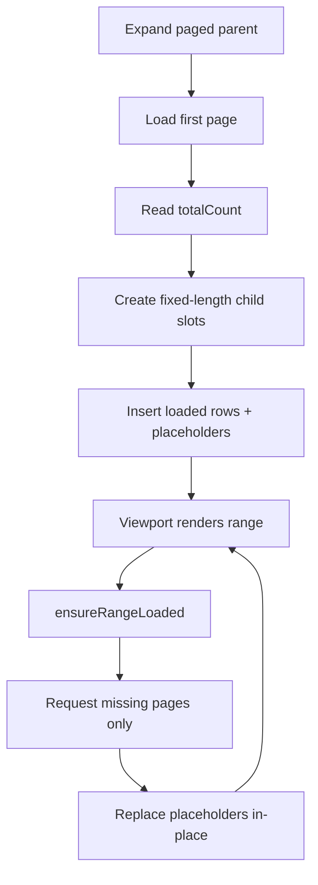

# Page-Aware Virtual Scroll

## Problem

Tree nodes backed by paginated APIs cannot pre-load all children, but virtual scrolling still requires accurate total height.

## Solution

For each paginated parent node:

1. Load first page.
2. Read `totalCount` (for example from `X-Total-Count`).
3. Materialize fixed-length child slots in `TreeEngine`.
4. Fill loaded slots with real nodes and remaining slots with placeholders.
5. On viewport range changes, request only missing pages for visible placeholder ranges.



## Core Contracts

```ts
interface PageRequest {
  pageIndex: number;
  pageSize: number;
}

interface PageResult<TSource> {
  items: TSource[];
  totalCount: number;
}

interface TreePaginationConfig {
  enabled: boolean;
  pageSize: number;
  pageIndexing?: 'zero-based' | 'one-based';
}
```

Adapter hooks:

```ts
getPagination?: (node, data?) => TreePaginationConfig | undefined;
loadChildren?: (node, reqOrSource?, data?) => TreeChildrenResult | TreePagedChildrenResult;
```

## Behavioral Guarantees

- No full prefetch: only requested pages are fetched.
- No forced intermediate loading: quick scroll can load late pages directly.
- In-flight dedupe: duplicate page requests for the same parent are prevented.
- Stable `trackBy`: placeholder IDs are deterministic (`parentId + index`).
- Placeholder safety: placeholders are disabled, non-selectable, and non-actionable.

## Error Handling

When page load fails:

- Placeholder rows remain in place.
- Failed page is tracked in page-error state.
- Subsequent range checks can retry failed pages.

## Sorting and Ordering

The feature assumes deterministic backend ordering per parent.

- No client-side re-sort is applied by default.
- If sorting is required, apply it at source/backend level.

## Edge Cases

- `totalCount` unknown before first response:
  - Parent initially has unknown children length.
  - Fixed length is created after first page result.
- One-based API indexing:
  - Internal engine page indices remain zero-based.
  - Requests are translated to one-based if adapter config declares `pageIndexing: 'one-based'`.
- Sparse final page:
  - Last page can contain fewer rows than `pageSize`; placeholders remain only where data is still unknown.

## Angular Integration

- `TreeExplorerComponent` subscribes to `renderedRangeStream`.
- Range events call `TreeStateService.ensureRangeLoaded(start,end)`.
- Service maps visible placeholder ranges to per-parent child-index windows.
- Service requests exactly the pages returned by `TreeEngine.ensureRangeLoaded`.

## Validation Story

Storybook includes:

- `Tree/Page-aware virtual scroll (X-Total-Count)`
- deterministic mock API
- real-time debug panel:
  - requested pages
  - in-flight pages
  - cached pages / cache size
  - total count extracted from `X-Total-Count`
