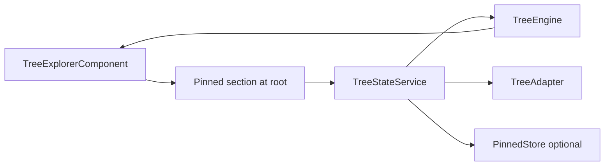

# Pinned Items

Date: 2026-02-10
Status: implemented (default: disabled)

Pinned Items adds root-level shortcuts to important nodes without duplicating nodes in `TreeEngine`.

## Purpose

- Let users Star/Unstar items from the centralized context menu.
- Keep pinned shortcuts visible at the top of the explorer.
- Navigate from a pinned shortcut to the node's real location in the tree.
- Keep backend persistence adapter-driven through optional store hooks.

## Architecture



## Contracts

### `TreePinnedEntry`

```ts
interface TreePinnedEntry {
  entryId: string;
  nodeId: TreeId;
  label?: string;
  icon?: string;
  order: number;
  meta?: unknown;
}
```

- `entryId` is the pinned record id (often backend-generated).
- `nodeId` points to the real `TreeNode` in the tree graph.

### `TreePinnedStore<T>`

```ts
interface TreePinnedStore<T> {
  loadPinned?: () => Promise<TreePinnedEntry[]> | Observable<TreePinnedEntry[]>;
  addPinned?: (node: TreeNode<T>) => Promise<TreePinnedEntry> | Observable<TreePinnedEntry>;
  removePinned?: (entry: TreePinnedEntry, node?: TreeNode<T>) => Promise<void> | Observable<void>;
  reorderPinned?: (entries: TreePinnedEntry[]) => Promise<void> | Observable<void>;
}
```

Store hooks are optional and keep API integration outside core.

### `TreeConfig.pinned`

```ts
interface TreePinnedConfig<T> {
  enabled?: boolean;
  label?: string;
  ids?: TreeId[];
  entries?: TreePinnedEntry[];
  store?: TreePinnedStore<T>;
  maxItems?: number;
  expandable?: boolean;
  canPin?: (ctx) => boolean;
  canUnpin?: (ctx) => boolean;
  resolvePinnedLabel?: (entry, ctx) => string;
  resolvePinnedIcon?: (entry, ctx) => string | undefined;
  onNavigate?: (nodeId: TreeId) => void;
  contextActions?: TreeContextAction<T>[];
  dnd?: { enabled?: boolean };
}
```

Behavior notes:

- `enabled` defaults to `false` for empty config, but is inferred as `true` for legacy static config with `ids` or `entries`.
- `ids` is legacy shorthand and remains supported.
- `entries` is preferred when records come from API.
- `expandable` is reserved for future behavior; current implementation is shortcut-only.

## Interaction Behavior

1. Node context menu shows `Star` when pinning is allowed.
2. Pinned entry context menu shows `Unstar` and optional pinned-specific actions.
3. Clicking a pinned shortcut:
   - expands loaded ancestors (`expandPath`)
   - scrolls node into view
   - selects and focuses the node when selection mode allows it
   - triggers optional `onNavigate(nodeId)` hook
4. Drag and drop in the pinned section reorders entries and calls `store.reorderPinned` when available.

## API Integration Pattern

- Startup: `loadPinned` (GET)
- Star action: `addPinned` (POST)
- Unstar action: `removePinned` (DELETE)
- Reorder: `reorderPinned` (POST/PATCH)

The library never imports HTTP clients in core. Consumers provide transport through `TreePinnedStore`.

## Edge Cases

- Missing node (`nodeId` no longer present): pinned item remains visible using cached label/icon and appears disabled.
- Renamed node: pinned label can be resolved from latest row data via `resolvePinnedLabel`.
- Permission changes: gate with `canPin` / `canUnpin` and adapter-level visibility/disabled logic.
- Lazy or paged branches: navigation works for loaded ancestry. Deep path loading beyond loaded graph remains adapter/wrapper strategy.

## Performance Notes

- Pinned section is rendered outside the virtual viewport and expected to stay small.
- `TreeEngine` flattened list is not duplicated for pinned shortcuts.
- Track keys are stable (`entryId`) and DnD reorder is O(k) for `k = pinned entries`.

## Storybook Reference

- [Cookbook story: pinned items](../packages/tree-explorer/src/stories/tree-explorer.pinned-cookbook.stories.ts)

## Migration Notes

- Existing config like `pinned: { ids: ['node-a'] }` keeps working.
- New apps should prefer `pinned.enabled` + `pinned.entries`/`pinned.store`.
- If you need to disable legacy static pins temporarily, set `pinned.enabled = false`.
