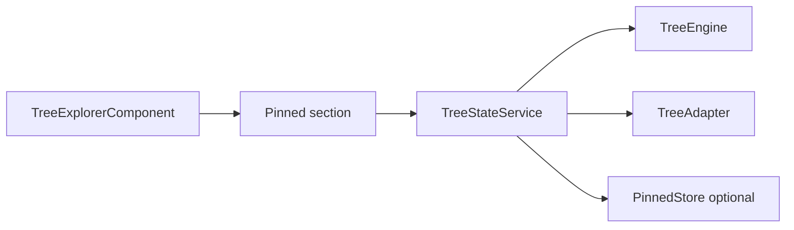
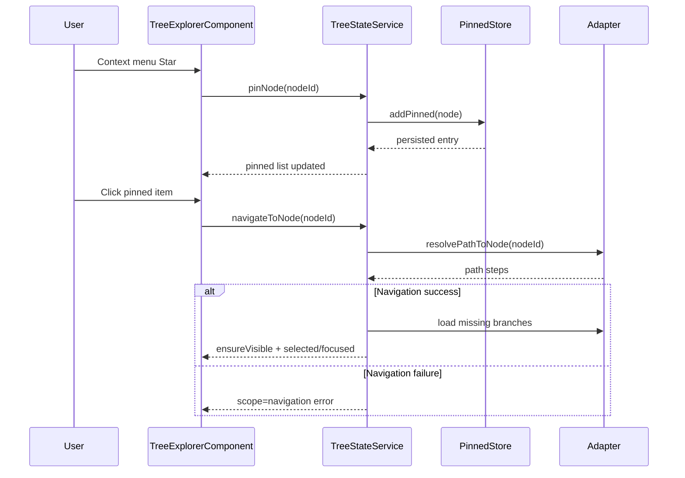

# Pinned Items

> Don’t paste this into your app. Read it, adapt it, and decide what you’re actually building.

## 1) Getting started

1. Enable pinned config in `TreeConfig`.
2. Provide static `entries` or `ids`, or wire `TreePinnedStore`.
3. Keep context-menu actions centralized in `TreeExplorerComponent`.
4. If targets may be unloaded, implement `adapter.resolvePathToNode`.
5. Validate with Storybook:
   - `Tree/Basic Usage`
   - `Tree/Errors & edge cases`

```ts
const config: Partial<TreeConfig<Node>> = {
  pinned: {
    enabled: true,
    entries: [{ entryId: 'pin-1', nodeId: 'target-node', order: 0 }],
  },
};
```

## 2) Purpose

- Provide root-level shortcuts without duplicating tree nodes.
- Support Star/Unstar + persistence hooks.
- Support async navigation to unloaded targets when adapter can resolve path steps.

## 3) Feature overview



Pinned behavior rules:

- Pinned items point to original node IDs.
- Missing nodes are rendered as pinned entries and can still be navigated when path resolution is available.
- Navigation success path:
  - resolve path
  - load missing branches/pages
  - expand/select/focus target.
- Navigation failure path:
  - emits navigation-scoped load error
  - no infinite loading loops
  - tree remains stable.

Pinned sequence:



## 4) API overview

### Config

| Field | Type | Default | Meaning | Notes |
|---|---|---|---|---|
| `enabled` | `boolean` | inferred by legacy ids/entries | Enables pinned section | Explicit is preferred |
| `label` | `string` | `'Pinned'` | Section heading | |
| `ids` | `TreeId[]` | `[]` | Legacy shorthand | Kept for compatibility |
| `entries` | `TreePinnedEntry[]` | `[]` | Explicit pinned records | Preferred |
| `store` | `TreePinnedStore<T>` | `undefined` | Persistence hooks | Optional |
| `maxItems` | `number` | `undefined` | Pinned cap | Guardrail |
| `canPin` / `canUnpin` | predicates | `undefined` | Action policy gates | Domain policy hook |
| `resolvePinnedLabel/Icon` | resolvers | `undefined` | Display override | Useful for stale labels |
| `onNavigate` | `(nodeId) => void` | `undefined` | Post-navigation callback | Called on successful navigation |
| `contextActions` | `TreeContextAction<T>[]` | `[]` | Pinned-specific context actions | Still wrapper-owned |
| `dnd.enabled` | `boolean` | `false` | Reorder interaction | Uses `store.reorderPinned` when available |

### Adapter extension for unloaded navigation

| Field | Type | Meaning |
|---|---|---|
| `resolvePathToNode` | `(targetId) => TreeResolvePathResponse` | Returns root->target step list with optional page hints |

### Migration notes

- Existing pinned config continues to work unchanged.
- Existing adapters continue to work unchanged.
- To enable unloaded-target pinned navigation, add `resolvePathToNode`.

## 5) Edge cases & failure modes

- Target node removed from dataset:
  - entry can remain visible; navigation may resolve to `not-found`.
- Path resolver unavailable:
  - emits `scope='navigation'`, reason `path-unavailable`.
- Path resolver throws:
  - emits `scope='navigation'`, reason `path-resolution-failed`.
- Branch load fails:
  - emits `scope='navigation'`, reason `load-failed`.
- Permission/eligibility constraints:
  - enforce with `canPin` and `canUnpin`.

## 6) Recipes

- API-backed pinned persistence:
  - implement `loadPinned`, `addPinned`, `removePinned`, `reorderPinned`.
- Async path-aware navigation for deep nodes:
  - return path steps from `resolvePathToNode`, including page hints where needed.
- Static shortcuts only:
  - use `entries` without store.
- Storybook references:
  - `packages/tree-explorer/src/stories/tree-explorer.advanced.stories.ts`
  - `packages/tree-explorer/src/stories/tree-explorer.errors-edge-cases.stories.ts`

## 7) Non-goals / pitfalls

- Do not duplicate pinned rows into `TreeEngine` node graph.
- Do not place pin/unpin orchestration inside row components.
- Do not hardcode backend calls in core libraries; keep in adapter/store.
- Do not assume missing pinned targets are errors by default; they are valid states.
